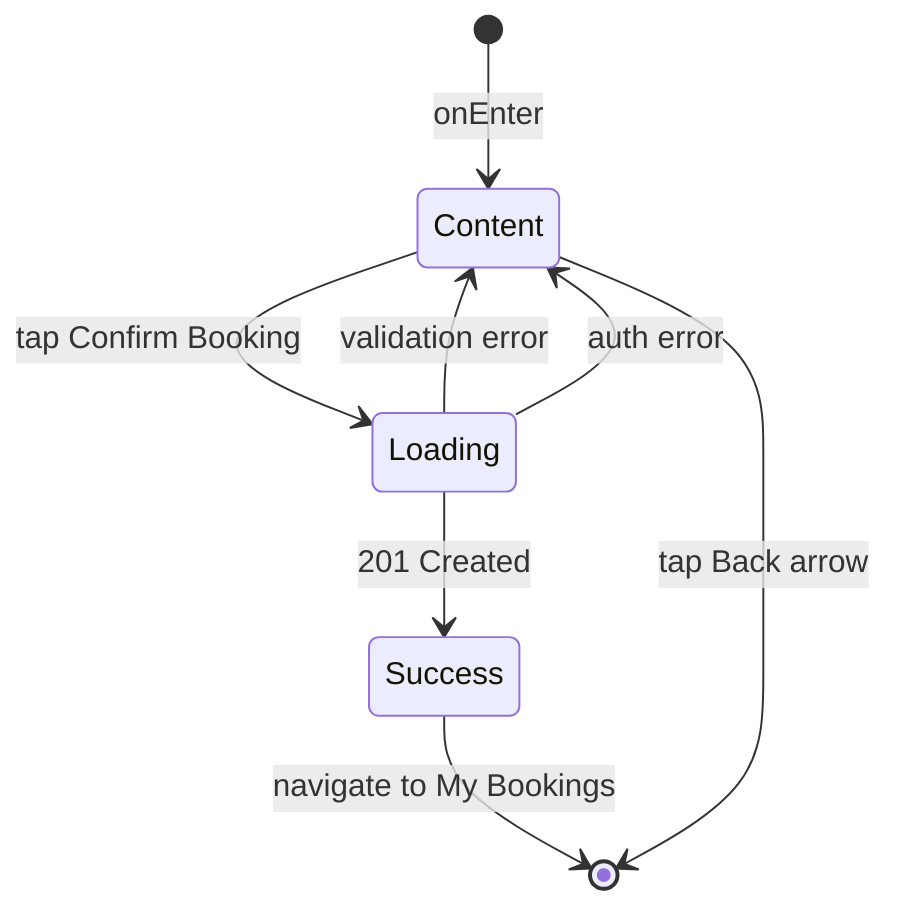

# Экран бронирования

**ID:** SCR-006  
**Тип:** Экран  
**Домен:** 05. Бронирование  
**Приоритет:** High  
**Статус:** Актуален  
**Функциональные блоки:** FB-BOOKINGS-001, FB-RENTAL-001  
**Зона авторизации:** АЗ  
**Дизайн-макет:**

---

## Содержание

- [История изменений](#история-изменений)
- [Обзор](#обзор)
- [Навигация](#навигация)
- [Входные данные](#входные-данные)
- [Применяемые логики](#применяемые-логики)
- [Инициализация](#инициализация)
- [Используемые запросы](#используемые-запросы)
- [Макет экрана](#макет-экрана)
- [Элементы экрана](#элементы-экрана)
- [Состояния экрана](#состояния-экрана)
- [Действия пользователя](#действия-пользователя)
- [Связанные требования](#связанные-требования)
- [Критерии приёмки](#критерии-приёмки)

---

## История изменений

| Релиз | ТЗ | Описание изменений |
|-------|-----|-------------------|
| 1.0.0 | [ТЗ на экран бронирования](../conclusion-overview.md) | Создание спецификации экрана бронирования |

---

## Обзор

Экран бронирования позволяет пользователю подтвердить бронирование кулинарного класса, выбрать пакет проката и указать информацию об аллергиях. Это последний шаг в процессе бронирования перед созданием записи в системе.

### User Story

> Как пользователь, я хочу подтвердить бронирование класса и указать
> дополнительную информацию, чтобы завершить процесс записи на класс.

### Бизнес-ценность

- Упрощение процесса бронирования
- Сбор важной информации (аллергии) для безопасности участников
- Повышение точности бронирований

---

## Навигация

### Входящая (откуда открывается)

| Источник | Триггер | Условие | Передаваемые параметры |
|----------|---------|---------|------------------------|
| [Class Detail Screen](class-detail-screen-spec.md) | Тап на кнопку "Забронировать" | Есть доступные места | `{classId}`, `{className}`, `{dateTime}`, `{rentalOptions}` |
| Deep link | `app://booking/{classId}` | Всегда | `{classId}` |

### Исходящая (куда ведёт)

| Назначение | Триггер | Передаваемые параметры |
|------------|---------|------------------------|
| [My Bookings Screen](my-bookings-screen-spec.md) | Успешное бронирование | `{bookingId}` |
| [Class Detail Screen](class-detail-screen-spec.md) | Отмена бронирования | — |

---

## Входные данные

| Название | Тип | Возможные значения | Описание |
|----------|-----|-------------------|----------|
| `{classId}` | Параметр экрана | `{validId}` | ID кулинарного класса для бронирования |
| `{className}` | Параметр экрана | `{className}` | Название класса (для отображения) |
| `{dateTime}` | Параметр экрана | `{dateTime}` | Дата и время класса (для отображения) |
| `{rentalOptions}` | Параметр экрана | `{optionsArray}` | Доступные пакеты проката |
| `{token}` | Защищённое хранилище | `{validJWT}` | Токен аутентификации пользователя |
| `{allergies}` | Кэш | `{allergyList}` | Информация об аллергиях из профиля |

---

## Применяемые логики

| Логика | Элемент/Триггер | Описание |
|--------|-----------------|----------|
| [Booking Logic](booking-logic-spec.md) | Создание бронирования | Обработка запроса на создание бронирования |
| [Profile Logic](auth-logic-spec.md) | Загрузка информации об аллергиях | Получение информации об аллергиях из профиля |

---

## Инициализация

### Диаграмма загрузки

```mermaid
flowchart LR
    Start([onEnter]) --> P1[/profile]
    
    P1 --> Ready([Content])
```

### Запросы при открытии

| № | Запрос | Критичный | Зависит от | Условие |
|---|--------|-----------|------------|---------|
| 1 | [/profile](#profile) | Нет | — | Всегда |

> Полное описание запросов см. в секции [Используемые запросы](#используемые-запросы).

---

## Используемые запросы

### /profile

**Тип:** REST  
**Метод:** GET  
**Спецификация:** [openapi-spec-final.yaml](../../api/openapi-spec-final.yaml) → `profile.get`

**Триггер:** Инициализация

**Headers:**

| Поле | Описание |
|------|----------|
| `authorization` | Bearer токен пользователя |

**Параметры:**

| Параметр | Тип | Обязательность | Источник | Описание |
|----------|-----|----------------|----------|----------|

**Обработка ответа:**

| Результат | Условие | UI-реакция |
|-----------|---------|------------|
| Загрузка | — | — (фоновая загрузка) |
| Успех (200) | Данные получены | Подтянуть информацию об аллергиях |
| HTTP 4xx | — | Использовать пустые значения |
| HTTP 5xx | — | Использовать пустые значения |
| Сеть | Нет соединения | Использовать пустые значения |

---

### /bookings

**Тип:** REST  
**Метод:** POST  
**Спецификация:** [openapi-spec-final.yaml](../../api/openapi-spec-final.yaml) → `bookings.create`

**Триггер:** Тап на кнопку "Подтвердить бронирование"

**Headers:**

| Поле | Описание |
|------|----------|
| `authorization` | Bearer токен пользователя |

**Параметры:**

| Параметр | Тип | Обязательность | Источник | Описание |
|----------|-----|----------------|----------|----------|
| `classId` | string | Да | `{classId}` | ID кулинарного класса |
| `rentalPackageId` | string | Да | Выбор пользователя | ID пакета проката |
| `allergies` | string | Нет | Поле ввода/профиль | Информация об аллергиях |

**Обработка ответа:**

| Результат | Условие | UI-реакция |
|-----------|---------|------------|
| Загрузка | — | Лоадер на кнопке, блокировка UI |
| Успех (201) | Бронирование создано | Переход на My Bookings с сообщением об успехе |
| HTTP 400 | Невалидные данные или нет мест | Снек с текстом из `message` |
| HTTP 401 | Неавторизованный доступ | Переход на экран входа |
| HTTP 409 | Конфликт бронирования | Снек с сообщением о двойной попытке бронирования |
| HTTP 5xx | — | Снек "Произошла ошибка. Попробуйте позже" |
| Сеть | Нет соединения | Снек "Нет соединения. Проверьте подключение" |

---

**Доступные спецификации:**

REST API (`api/`):
- `openapi-spec-final.yaml` — основная схема API

---

## Макет экрана

### Структура

```
┌─────────────────────────────────────┐
│ [←] Подтверждение бронирования      │  ← Header
├─────────────────────────────────────┤
│                                     │
│      Информация о классе            │  ← Scrollable
│                                     │
├─────────────────────────────────────┤
│                                     │
│      Выбор пакета проката           │  ← Scrollable
│                                     │
├─────────────────────────────────────┤
│                                     │
│      Информация об аллергиях        │  ← Scrollable
│                                     │
├─────────────────────────────────────┤
│                                     │
│      Информация об оплате           │  ← Scrollable
│                                     │
├─────────────────────────────────────┤
│      [Подтвердить бронирование]     │  ← Кнопка внизу
└─────────────────────────────────────┘
```

### Компоненты

| Компонент | Описание | Обязательность |
|-----------|----------|----------------|
| Информация о классе | Название, дата, время | Да |
| Выбор пакета проката | Список доступных пакетов | Да |
| Поле аллергий | Для указания аллергий | Опционально |
| Информация об оплате | Подробности оплаты | Да |
| Кнопка подтверждения | Для создания бронирования | Да |

---

## Элементы экрана

### 1. Информация о классе

| Элемент | Описание | Источник данных | Валидация | Действие |
|---------|----------|-----------------|-----------|----------|
| Название класса | Название бронируемого класса | `{className}` | — | — |
| Дата и время | Время проведения класса | `{dateTime}` | — | — |
| Цена класса | Стоимость участия | `{classData}` | — | — |

**Логика:**
- Информация о классе: Отображение базовой информации о бронируемом классе

### 2. Выбор пакета проката

| Элемент | Описание | Источник данных | Валидация | Действие |
|---------|----------|-----------------|-----------|----------|
| Список пакетов | Доступные пакеты проката | `{rentalOptions}` | — | Выбор пакета |
| Выбранный пакет | Индикатор выбранного пакета | Выбор пользователя | — | — |

**Логика:**
- Выбор пакета: При выборе → сохранение выбранного пакета для отправки в запросе

### 3. Информация об аллергиях

| Элемент | Описание | Источник данных | Валидация | Действие |
|---------|----------|-----------------|-----------|----------|
| Поле аллергий | Текстовое поле для указания аллергий | `{allergies}` из профиля | — | Редактирование |
| Подсказка | "Укажите аллергии, если они есть" | — | — | — |

**Логика:**
- Поле аллергий: При открытии → подтянуть данные из профиля, возможность редактирования

### 4. Информация об оплате

| Элемент | Описание | Источник данных | Валидация | Действие |
|---------|----------|-----------------|-----------|----------|
| Метод оплаты | "Оплата на месте" | — | — | — |
| Сумма к оплате | Общая сумма (класс + прокат) | Вычислено | — | — |

**Логика:**
- Информация об оплате: Вычисление общей суммы на основе выбранного пакета

### 5. Кнопка "Подтвердить бронирование"

| Элемент | Описание | Источник данных | Валидация | Действие |
|---------|----------|-----------------|-----------|----------|
| Кнопка "Подтвердить" | Основная кнопка действия | — | — | Отправка запроса [/bookings](#bookings) |

**Момент валидации:** При тапе на кнопку "Подтвердить"

**Логика:**
- Кнопка "Подтвердить": При тапе → сбор всех данных → отправка запроса [/bookings](#bookings)

**Условия доступности:**
- Кнопка "Подтвердить" активна, если: пользователь авторизован

---

## Состояния экрана

### Таблица состояний

| Состояние | Условие | Отображение |
|-----------|---------|-------------|
| Content | Всегда | Стандартный контент с информацией о бронировании |
| Loading | При отправке запроса | Лоадер на кнопке, блокировка UI |
| Success | После успешного бронирования | Сообщение об успехе и переход к My Bookings |

### Диаграмма переходов



---

## Действия пользователя

| Действие | Элемент | Триггер | Результат |
|----------|---------|---------|-----------|
| Выбор пакета проката | Список пакетов | Tap | Выбор активного пакета |
| Редактирование аллергий | Поле аллергий | Input | Изменение информации об аллергиях |
| Подтверждение брони | Кнопка "Подтвердить" | Tap | Создание бронирования |
| Отмена брони | Кнопка "Назад" | Tap | Возврат к предыдущему экрану |

---

## Связанные требования

### Функциональные (REQ-FUNC-*)

| ID | Название | Приоритет |
|----|----------|-----------|
| REQ-FUNC-014 | Подтверждение бронирования | High |
| REQ-FUNC-015 | Выбор пакета проката | Medium |
| REQ-FUNC-016 | Указание аллергий | Medium |

### Интеграции (REQ-INT-*)

| ID | Название | Приоритет |
|----|----------|-----------|
| REQ-INT-010 | Интеграция с /bookings | High |
| REQ-INT-011 | Интеграция с /profile | Medium |

### UI (REQ-UI-*)

| ID | Название | Приоритет |
|----|----------|-----------|
| REQ-UI-011 | Адаптивный дизайн формы бронирования | Medium |
| REQ-UI-012 | Отображение информации об оплате | Low |

### Данные (REQ-DATA-*)

| ID | Название | Приоритет |
|----|----------|-----------|
| REQ-DATA-009 | Временное хранение данных бронирования | Medium |
| REQ-DATA-010 | Обновление информации об аллергиях | Low |

---

## Критерии приёмки

### Позитивные сценарии

| ID | Критерий | Приоритет |
|----|----------|-----------|
| AC-001 | **Дано** пользователь на экране бронирования, **Когда** подтверждает бронирование, **Тогда** создается запись в системе и отображается сообщение об успехе | P0 |
| AC-002 | **Дано** пользователь открывает экран, **Когда** видит информацию из профиля, **Тогда** данные об аллергиях подтягиваются автоматически | P0 |

### Негативные сценарии

| ID | Критерий | Приоритет |
|----|----------|-----------|
| AC-N01 | **Дано** ошибка сети, **Когда** подтверждение бронирования, **Тогда** отображается сообщение об ошибке | P0 |
| AC-N02 | **Дано** нет доступных мест, **Когда** подтверждение бронирования, **Тогда** отображается соответствующее сообщение | P0 |

### Граничные условия (Edge Cases)

| ID | Критерий | Приоритет |
|----|----------|-----------|
| AC-E01 | **Дано** двойная попытка бронирования, **Когда** одновременные запросы, **Тогда** отображается сообщение о конфликте | P1 |
| AC-E02 | **Дано** потеря сети во время запроса, **Когда** восстановление, **Тогда** возможность повторной попытки | P2 |