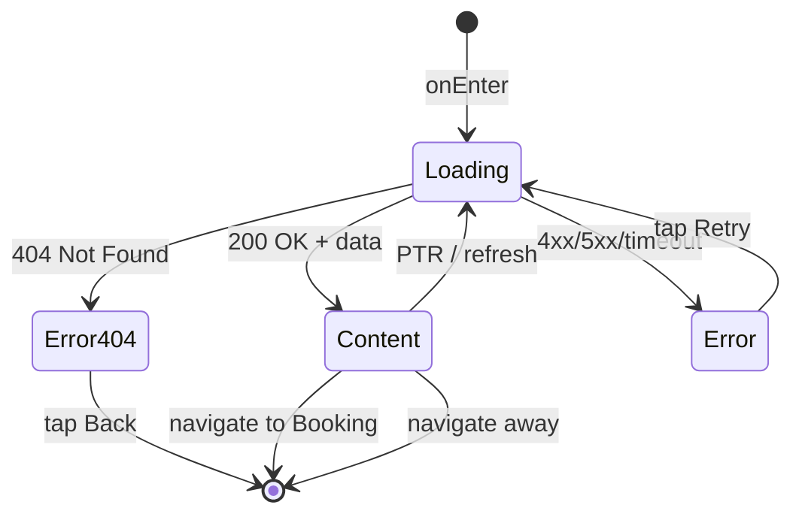

# Экран деталей класса

**ID:** SCR-005  
**Тип:** Экран  
**Домен:** 04. Детали класса  
**Приоритет:** High  
**Статус:** Актуален  
**Функциональные блоки:** FB-CLASSES-001, FB-CHEFS-001, FB-REVIEWS-001  
**Зона авторизации:** АЗ  
**Дизайн-макет:**

---

## Содержание

- [История изменений](#история-изменений)
- [Обзор](#обзор)
- [Навигация](#навигация)
- [Входные данные](#входные-данные)
- [Применяемые логики](#применяемые-логики)
- [Инициализация](#инициализация)
- [Используемые запросы](#используемые-запросы)
- [Макет экрана](#макет-экрана)
- [Элементы экрана](#элементы-экрана)
- [Состояния экрана](#состояния-экрана)
- [Действия пользователя](#действия-пользователя)
- [Связанные требования](#связанные-требования)
- [Критерии приёмки](#критерии-приёмки)

---

## История изменений

| Релиз | ТЗ | Описание изменений |
|-------|-----|-------------------|
| 1.0.0 | [ТЗ на экран деталей класса](../conclusion-overview.md) | Создание спецификации экрана деталей класса |

---

## Обзор

Экран деталей класса предоставляет подробную информацию о конкретном кулинарном классе, включая описание, информацию о шефе, дату и время проведения, доступные места и варианты проката. Также позволяет пользователю забронировать место на классе.

### User Story

> Как пользователь, я хочу видеть детальную информацию о классе,
> чтобы принять решение о его посещении и забронировать место.

### Бизнес-ценность

- Повышение информированности пользователей о классах
- Упрощение процесса бронирования
- Повышение конверсии в бронирования

---

## Навигация

### Входящая (откуда открывается)

| Источник | Триггер | Условие | Передаваемые параметры |
|----------|---------|---------|------------------------|
| [Schedule Screen](schedule-screen-spec.md) | Тап на класс | Всегда | `{classId}` |
| [Home Screen](home-screen-spec.md) | Тап на рекомендуемый класс | Всегда | `{classId}` |
| Deep link | `app://class/{classId}` | Всегда | `{classId}` |

### Исходящая (куда ведёт)

| Назначение | Триггер | Передаваемые параметры |
|------------|---------|------------------------|
| [Booking Screen](booking-screen-spec.md) | Тап на кнопку "Забронировать" | `{classId}`, `{className}`, `{dateTime}` |
| [Chef Detail](#) | Тап на информацию о шефе | `{chefId}` |

---

## Входные данные

| Название | Тип | Возможные значения | Описание |
|----------|-----|-------------------|----------|
| `{classId}` | Параметр экрана | `{validId}` | ID кулинарного класса для отображения |
| `{token}` | Защищённое хранилище | `{validJWT}` | Токен аутентификации пользователя |

---

## Применяемые логики

| Логика | Элемент/Триггер | Описание |
|--------|-----------------|----------|
| [Class Logic](#) | Загрузка информации о классе | Получение деталей класса по ID |
| [Booking Logic](booking-logic-spec.md) | Начало процесса бронирования | Подготовка данных для бронирования |

---

## Инициализация

### Диаграмма загрузки

```mermaid
flowchart LR
    Start([onEnter]) --> P1[/classes/{classId}]
    
    P1 --> Ready([Content])
```

### Запросы при открытии

| № | Запрос | Критичный | Зависит от | Условие |
|---|--------|-----------|------------|---------|
| 1 | [/classes/{classId}](#classesclassid) | Да | — | Всегда |

> Полное описание запросов см. в секции [Используемые запросы](#используемые-запросы).

---

## Используемые запросы

### /classes/{classId}

**Тип:** REST  
**Метод:** GET  
**Спецификация:** [openapi-spec-final.yaml](../../api/openapi-spec-final.yaml) → `classes.getClassById`

**Триггер:** Инициализация

**Headers:**

| Поле | Описание |
|------|----------|
| `authorization` | Bearer токен пользователя (необязательно) |

**Параметры:**

| Параметр | Тип | Обязательность | Источник | Описание |
|----------|-----|----------------|----------|----------|
| `classId` | string | Да | `{classId}` | ID кулинарного класса |

**Обработка ответа:**

| Результат | Условие | UI-реакция |
|-----------|---------|------------|
| Загрузка | — | Скелетон / Шиммер блока |
| Успех (200) | Класс найден | Отобразить детали класса |
| HTTP 404 | Класс не найден | Error state с кнопкой "Назад" |
| HTTP 4xx | — | Error state с кнопкой "Обновить" |
| HTTP 5xx | — | Error state с кнопкой "Обновить" |
| Сеть | Нет соединения | Error state с кнопкой "Обновить" |

---

### /chefs/{chefId}

**Тип:** REST  
**Метод:** GET  
**Спецификация:** [openapi-spec-final.yaml](../../api/openapi-spec-final.yaml) → `chefs.getChefById`

**Триггер:** Инициализация (если требуется дополнительная информация о шефе)

**Headers:**

| Поле | Описание |
|------|----------|
| `authorization` | Bearer токен пользователя (необязательно) |

**Параметры:**

| Параметр | Тип | Обязательность | Источник | Описание |
|----------|-----|----------------|----------|----------|
| `chefId` | string | Да | Данные класса | ID шефа |

**Обработка ответа:**

| Результат | Условие | UI-реакция |
|-----------|---------|------------|
| Загрузка | — | — (фоновая загрузка) |
| Успех (200) | Шеф найден | Отобразить дополнительную информацию о шефе |
| HTTP 404 | Шеф не найден | Использовать базовую информацию из класса |
| HTTP 4xx | — | — (использовать базовую информацию) |
| HTTP 5xx | — | — (использовать базовую информацию) |
| Сеть | Нет соединения | — (использовать базовую информацию) |

---

**Доступные спецификации:**

REST API (`api/`):
- `openapi-spec-final.yaml` — основная схема API

---

## Макет экрана

### Структура

```
┌─────────────────────────────────────┐
│ [←] Детали класса                   │  ← Header
├─────────────────────────────────────┤
│                                     │
│         Название и описание         │  ← Scrollable
│              класса                 │
│                                     │
├─────────────────────────────────────┤
│                                     │
│          Информация о шефе          │  ← Scrollable
│                                     │
├─────────────────────────────────────┤
│                                     │
│        Дата, время, места           │  ← Scrollable
│                                     │
├─────────────────────────────────────┤
│                                     │
│         Варианты проката            │  ← Scrollable
│                                     │
├─────────────────────────────────────┤
│                                     │
│           Отзывы о шефе             │  ← Scrollable
│                                     │
├─────────────────────────────────────┤
│        [Забронировать]              │  ← Кнопка внизу
└─────────────────────────────────────┘
```

### Компоненты

| Компонент | Описание | Обязательность |
|-----------|----------|----------------|
| Название и описание класса | Основная информация о классе | Да |
| Информация о шефе | Данные о проводящем шеф-поваре | Да |
| Дата и время | Время и дата проведения класса | Да |
| Доступные места | Индикатор свободных мест | Да |
| Варианты проката | Доступное оборудование для аренды | Да |
| Отзывы о шефе | Отзывы других пользователей | Опционально |
| Кнопка "Забронировать" | Кнопка для начала процесса бронирования | Да |

---

## Элементы экрана

### 1. Основная информация о классе

| Элемент | Описание | Источник данных | Валидация | Действие |
|---------|----------|-----------------|-----------|----------|
| Название класса | Заголовок класса | `/classes/{classId}` | — | — |
| Описание класса | Подробное описание | `/classes/{classId}` | — | — |
| Тип класса | Категория сложности | `/classes/{classId}` | — | — |
| Цена класса | Стоимость участия | `/classes/{classId}` | — | — |

**Логика:**
- Основная информация: [Class Logic](#) — отображение базовых данных класса

### 2. Информация о шефе

| Элемент | Описание | Источник данных | Валидация | Действие |
|---------|----------|-----------------|-----------|----------|
| Имя шефа | Имя проводящего шефа | `/classes/{classId}` | — | — |
| Специализация | Направление кухни | `/classes/{classId}` | — | — |
| Рейтинг | Средняя оценка шефа | `/classes/{classId}` | — | — |
| Биография | Краткая информация | `/classes/{classId}` | — | — |

**Логика:**
- Информация о шефе: При необходимости дополнительной информации → вызов [/chefs/{chefId}](#chefschefid)

### 3. Дата и время

| Элемент | Описание | Источник данных | Валидация | Действие |
|---------|----------|-----------------|-----------|----------|
| Дата и время | Время начала класса | `/classes/{classId}` | — | — |
| Продолжительность | Длительность класса | `/classes/{classId}` | — | — |
| Доступные места | Количество свободных мест | `/classes/{classId}` | — | — |

**Логика:**
- Дата и время: Отображение в понятном для пользователя формате

### 4. Варианты проката

| Элемент | Описание | Источник данных | Валидация | Действие |
|---------|----------|-----------------|-----------|----------|
| Варианты оборудования | Доступные пакеты проката | `/rental-packages` | — | — |

**Логика:**
- Варианты проката: При выборе → сохранение выбора для следующего экрана

### 5. Отзывы о шефе

| Элемент | Описание | Источник данных | Валидация | Действие |
|---------|----------|-----------------|-----------|----------|
| Список отзывов | Отзывы о шефе | `/reviews` | — | — |

**Логика:**
- Отзывы: [Review Logic](review-logic-spec.md) — загрузка отзывов о шефе

### 6. Кнопка "Забронировать"

| Элемент | Описание | Источник данных | Валидация | Действие |
|---------|----------|-----------------|-----------|----------|
| Кнопка "Забронировать" | Основная кнопка действия | `/classes/{classId}` | — | Навигация к [Booking Screen](booking-screen-spec.md) |

**Логика:**
- Кнопка "Забронировать": При тапе → проверка наличия мест → навигация к [Booking Screen](booking-screen-spec.md)

**Условия доступности:**
- Кнопка "Забронировать" активна, если: есть доступные места И пользователь авторизован

---

## Состояния экрана

### Таблица состояний

| Состояние | Условие | Отображение |
|-----------|---------|-------------|
| Loading | Ожидание API | Скелетон-шиммер для всех блоков |
| Content | API 200 + данные | Стандартный контент с информацией о классе |
| Error | API 4xx/5xx | Error state с кнопкой "Обновить" |
| Error | API 404 | Error state с кнопкой "Назад" |
| Empty | Нет доступных мест | Сообщение "Нет доступных мест" |

### Диаграмма переходов



---

## Действия пользователя

| Действие | Элемент | Триггер | Результат |
|----------|---------|---------|-----------|
| Просмотр информации | Контент экрана | Scroll | Просмотр всей информации о классе |
| Выбор пакета проката | Варианты оборудования | Tap | Выбор пакета для следующего экрана |
| Бронирование | Кнопка "Забронировать" | Tap | Переход на [Booking Screen](booking-screen-spec.md) |
| Обновление | Pull to refresh | Pull down | Обновление данных класса |

---

## Связанные требования

### Функциональные (REQ-FUNC-*)

| ID | Название | Приоритет |
|----|----------|-----------|
| REQ-FUNC-011 | Отображение деталей класса | High |
| REQ-FUNC-012 | Отображение информации о шефе | Medium |
| REQ-FUNC-013 | Начало процесса бронирования | High |

### Интеграции (REQ-INT-*)

| ID | Название | Приоритет |
|----|----------|-----------|
| REQ-INT-008 | Интеграция с /classes/{classId} | High |
| REQ-INT-009 | Интеграция с /chefs/{chefId} | Medium |

### UI (REQ-UI-*)

| ID | Название | Приоритет |
|----|----------|-----------|
| REQ-UI-009 | Адаптивный дизайн экрана деталей | Medium |
| REQ-UI-010 | Индикатор доступных мест | Medium |

### Данные (REQ-DATA-*)

| ID | Название | Приоритет |
|----|----------|-----------|
| REQ-DATA-007 | Кэширование информации о классе | Medium |
| REQ-DATA-008 | Сохранение выбора пакета проката | Low |

---

## Критерии приёмки

### Позитивные сценарии

| ID | Критерий | Приоритет |
|----|----------|-----------|
| AC-001 | **Дано** пользователь на экране деталей класса, **Когда** открывает экран, **Тогда** видит всю информацию о классе | P0 |
| AC-002 | **Дано** пользователь на экране деталей, **Когда** нажимает "Забронировать", **Тогда** переходит на экран бронирования | P0 |

### Негативные сценарии

| ID | Критерий | Приоритет |
|----|----------|-----------|
| AC-N01 | **Дано** ошибка сети, **Когда** открытие экрана деталей, **Тогда** отображается error state с кнопкой "Обновить" | P0 |
| AC-N02 | **Дано** класс не существует, **Когда** открытие с неверным ID, **Тогда** отображается сообщение об ошибке | P0 |

### Граничные условия (Edge Cases)

| ID | Критерий | Приоритет |
|----|----------|-----------|
| AC-E01 | **Дано** нет доступных мест, **Когда** открытие экрана, **Тогда** кнопка "Забронировать" отключена | P1 |
| AC-E02 | **Дано** потеря сети во время работы, **Когда** восстановление, **Тогда** автоматическое обновление данных | P2 |