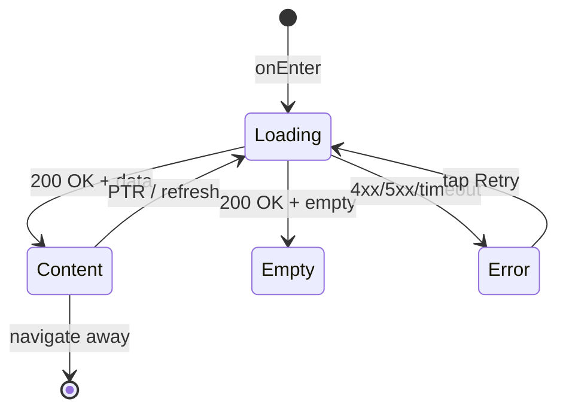

# Экран главной страницы (Home)

**ID:** SCR-003  
**Тип:** Экран  
**Домен:** 02. Главная  
**Приоритет:** High  
**Статус:** Актуален  
**Функциональные блоки:** FB-HOME-001, FB-BOOKINGS-001, FB-CLASSES-001  
**Зона авторизации:** АЗ  
**Дизайн-макет:**

---

## Содержание

- [История изменений](#история-изменений)
- [Обзор](#обзор)
- [Навигация](#навигация)
- [Входные данные](#входные-данные)
- [Применяемые логики](#применяемые-логики)
- [Инициализация](#инициализация)
- [Используемые запросы](#используемые-запросы)
- [Макет экрана](#макет-экрана)
- [Элементы экрана](#элементы-экрана)
- [Состояния экрана](#состояния-экрана)
- [Действия пользователя](#действия-пользователя)
- [Связанные требования](#связанные-требования)
- [Критерии приёмки](#критерии-приёмки)

---

## История изменений

| Релиз | ТЗ | Описание изменений |
|-------|-----|-------------------|
| 1.0.0 | [ТЗ на главный экран](../conclusion-overview.md) | Создание спецификации экрана главной страницы |

---

## Обзор

Экран главной страницы является стартовой точкой для авторизованных пользователей приложения "Кулинарная студия". Предоставляет обзор ближайших бронирований и рекомендуемых классов, а также быстрый доступ к основным функциям приложения.

### User Story

> Как авторизованный пользователь, я хочу видеть на главной странице
> ближайшие бронирования и рекомендуемые классы, чтобы быстро получить
> доступ к актуальной информации.

### Бизнес-ценность

- Улучшение пользовательского опыта через персонализированный контент
- Повышение вовлеченности пользователей
- Ускорение доступа к ключевым функциям приложения

---

## Навигация

### Входящая (откуда открывается)

| Источник | Триггер | Условие | Передаваемые параметры |
|----------|---------|---------|------------------------|
| [Login Screen](login-screen-spec.md) | Успешный вход | Всегда | `{token}`, `{clientInfo}` |
| [Bottom Navigation](#) | Тап на иконку "Главная" | Всегда | — |
| Deep link | `app://home` | Всегда | — |

### Исходящая (куда ведёт)

| Назначение | Триггер | Передаваемые параметры |
|------------|---------|------------------------|
| [Schedule Screen](schedule-screen-spec.md) | Тап на кнопку "Посмотреть все классы" | — |
| [Class Detail Screen](class-detail-screen-spec.md) | Тап на рекомендуемый класс | `{classId}` |
| [Booking Detail](my-bookings-screen-spec.md) | Тап на ближайшее бронирование | `{bookingId}` |

---

## Входные данные

| Название | Тип | Возможные значения | Описание |
|----------|-----|-------------------|----------|
| `{token}` | Защищённое хранилище | `{validJWT}` | Токен аутентификации пользователя |
| `{userId}` | Защищённое хранилище | `{userId}` | ID текущего пользователя |

---

## Применяемые логики

| Логика | Элемент/Триггер | Описание |
|--------|-----------------|----------|
| [Profile Logic](auth-logic-spec.md) | Загрузка профиля | Получение информации о пользователе |
| [Booking Logic](booking-logic-spec.md) | Загрузка бронирований | Получение ближайших бронирований |

---

## Инициализация

### Диаграмма загрузки

```mermaid
flowchart LR
    Start([onEnter]) --> P1[/profile]
    Start --> P2[/bookings]
    Start --> P3[/classes]
    
    P1 --> Ready([Content])
    P2 --> Ready
    P3 --> Ready
```

### Запросы при открытии

| № | Запрос | Критичный | Зависит от | Условие |
|---|--------|-----------|------------|---------|
| 1 | [/profile](#profile) | Да | — | Всегда |
| 2 | [/bookings](#bookings) | Да | №1 | Всегда |
| 3 | [/classes](#classes) | Нет | — | Всегда |

> Полное описание запросов см. в секции [Используемые запросы](#используемые-запросы).

---

## Используемые запросы

### /profile

**Тип:** REST  
**Метод:** GET  
**Спецификация:** [openapi-spec-final.yaml](../../api/openapi-spec-final.yaml) → `profile.get`

**Триггер:** Инициализация

**Headers:**

| Поле | Описание |
|------|----------|
| `authorization` | Bearer токен пользователя |

**Параметры:**

| Параметр | Тип | Обязательность | Источник | Описание |
|----------|-----|----------------|----------|----------|

**Обработка ответа:**

| Результат | Условие | UI-реакция |
|-----------|---------|------------|
| Загрузка | — | Скелетон / Шиммер блока |
| Успех (200) | Данные получены | Отображение информации о пользователе |
| HTTP 4xx | — | Error state с кнопкой "Обновить" |
| HTTP 5xx | — | Error state с кнопкой "Обновить" |
| Сеть | Нет соединения | Error state с кнопкой "Обновить" |

---

### /bookings

**Тип:** REST  
**Метод:** GET  
**Спецификация:** [openapi-spec-final.yaml](../../api/openapi-spec-final.yaml) → `bookings.get`

**Триггер:** Инициализация

**Headers:**

| Поле | Описание |
|------|----------|
| `authorization` | Bearer токен пользователя |

**Параметры:**

| Параметр | Тип | Обязательность | Источник | Описание |
|----------|-----|----------------|----------|----------|
| `status` | string | Нет | — | Фильтр по статусу бронирования |

**Обработка ответа:**

| Результат | Условие | UI-реакция |
|-----------|---------|------------|
| Загрузка | — | Скелетон / Шиммер блока |
| Успех (200) | `data` не пуст | Отобразить ближайшие бронирования |
| Успех (200) | `data` пуст | Отобразить сообщение "Нет предстоящих бронирований" |
| HTTP 4xx | — | Error state с кнопкой "Обновить" |
| HTTP 5xx | — | Error state с кнопкой "Обновить" |
| Сеть | Нет соединения | Error state с кнопкой "Обновить" |

---

### /classes

**Тип:** REST  
**Метод:** GET  
**Спецификация:** [openapi-spec-final.yaml](../../api/openapi-spec-final.yaml) → `classes.get`

**Триггер:** Инициализация

**Headers:**

| Поле | Описание |
|------|----------|
| `authorization` | Bearer токен пользователя (необязательно) |

**Параметры:**

| Параметр | Тип | Обязательность | Источник | Описание |
|----------|-----|----------------|----------|----------|
| `date_from` | string | Нет | — | Начальная дата фильтрации |
| `date_to` | string | Нет | — | Конечная дата фильтрации |

**Обработка ответа:**

| Результат | Условие | UI-реакция |
|-----------|---------|------------|
| Загрузка | — | Скелетон / Шиммер блока |
| Успех (200) | `data` не пуст | Отобразить рекомендуемые классы |
| Успех (200) | `data` пуст | Отобразить сообщение "Нет доступных классов" |
| HTTP 4xx | — | Error state с кнопкой "Обновить" |
| HTTP 5xx | — | Error state с кнопкой "Обновить" |
| Сеть | Нет соединения | Error state с кнопкой "Обновить" |

---

**Доступные спецификации:**

REST API (`api/`):
- `openapi-spec-final.yaml` — основная схема API

---

## Макет экрана

### Структура

```
┌─────────────────────────────────────┐
│ [←] Главная               [Профиль] │  ← Header
├─────────────────────────────────────┤
│                                     │
│      Блок "Ближайшие бронирования"  │  ← Scrollable
│                                     │
│                                     │
│       Блок "Рекомендуемые классы"   │  ← Scrollable
│                                     │
├─────────────────────────────────────┤
│     [Посмотреть все классы]         │  ← Кнопка внизу
└─────────────────────────────────────┘
```

### Компоненты

| Компонент | Описание | Обязательность |
|-----------|----------|----------------|
| Блок ближайших бронирований | Список ближайших бронирований пользователя | Да |
| Блок рекомендуемых классов | Карусель с рекомендуемыми классами | Да |
| Кнопка "Посмотреть все классы" | Кнопка для перехода к полному расписанию | Да |
| Статус авторизации | Индикатор статуса пользователя | Да |

---

## Элементы экрана

### 1. Блок "Ближайшие бронирования"

| Элемент | Описание | Источник данных | Валидация | Действие |
|---------|----------|-----------------|-----------|----------|
| Заголовок блока | "Ближайшие бронирования" | — | — | — |
| Список бронирований | Список объектов Booking | `/bookings` | — | Тап → [Booking Detail](my-bookings-screen-spec.md) |
| Сообщение "Нет бронирований" | Текст при отсутствии бронирований | `/bookings` | — | — |

**Логика:**
- Список бронирований: [Booking Logic](booking-logic-spec.md) — отображение бронирований с фильтром по ближайшим датам

### 2. Блок "Рекомендуемые классы"

| Элемент | Описание | Источник данных | Валидация | Действие |
|---------|----------|-----------------|-----------|----------|
| Заголовок блока | "Рекомендуемые классы" | — | — | — |
| Карусель классов | Карусель объектов CookingClass | `/classes` | — | Тап → [Class Detail](class-detail-screen-spec.md) |
| Сообщение "Нет классов" | Текст при отсутствии классов | `/classes` | — | — |

**Логика:**
- Карусель классов: Алгоритм рекомендаций — отображение наиболее релевантных классов для пользователя

### 3. Кнопка "Посмотреть все классы"

| Элемент | Описание | Источник данных | Валидация | Действие |
|---------|----------|-----------------|-----------|----------|
| Кнопка "Посмотреть все классы" | Primary button | — | — | Открыть [Schedule Screen](schedule-screen-spec.md) |

**Логика:**
- Кнопка "Посмотреть все классы": При тапе → навигация к [Schedule Screen](schedule-screen-spec.md)

---

## Состояния экрана

### Таблица состояний

| Состояние | Условие | Отображение |
|-----------|---------|-------------|
| Loading | Ожидание API | Скелетон-шиммер для всех блоков |
| Content | API 200 + данные | Стандартный контент с бронированиями и классами |
| Empty | API 200 + нет данных | Сообщения об отсутствии бронирований/классов |
| Error | API 4xx/5xx | Error state с кнопкой "Обновить" |

### Диаграмма переходов



---

## Действия пользователя

| Действие | Элемент | Триггер | Результат |
|----------|---------|---------|-----------|
| Просмотр бронирований | Список бронирований | Scroll | Просмотр ближайших бронирований |
| Просмотр классов | Карусель классов | Scroll | Просмотр рекомендуемых классов |
| Переход к деталям бронирования | Элемент списка | Tap | Переход на [Booking Detail](my-bookings-screen-spec.md) |
| Переход к деталям класса | Карточка класса | Tap | Переход на [Class Detail](class-detail-screen-spec.md) |
| Просмотр расписания | Кнопка "Посмотреть все" | Tap | Переход на [Schedule Screen](schedule-screen-spec.md) |

---

## Связанные требования

### Функциональные (REQ-FUNC-*)

| ID | Название | Приоритет |
|----|----------|-----------|
| REQ-FUNC-005 | Отображение ближайших бронирований | High |
| REQ-FUNC-006 | Отображение рекомендуемых классов | High |
| REQ-FUNC-007 | Быстрый доступ к расписанию | Medium |

### Интеграции (REQ-INT-*)

| ID | Название | Приоритет |
|----|----------|-----------|
| REQ-INT-003 | Интеграция с /profile | High |
| REQ-INT-004 | Интеграция с /bookings | High |
| REQ-INT-005 | Интеграция с /classes | Medium |

### UI (REQ-UI-*)

| ID | Название | Приоритет |
|----|----------|-----------|
| REQ-UI-005 | Адаптивный дизайн главного экрана | Medium |
| REQ-UI-006 | Карусель рекомендуемых классов | Medium |

### Данные (REQ-DATA-*)

| ID | Название | Приоритет |
|----|----------|-----------|
| REQ-DATA-003 | Кэширование данных профиля | Medium |
| REQ-DATA-004 | Кэширование бронирований | Medium |

---

## Критерии приёмки

### Позитивные сценарии

| ID | Критерий | Приоритет |
|----|----------|-----------|
| AC-001 | **Дано** пользователь авторизован, **Когда** открывает главный экран, **Тогда** видит ближайшие бронирования и рекомендуемые классы | P0 |
| AC-002 | **Дано** пользователь на главном экране, **Когда** нажимает "Посмотреть все классы", **Тогда** переходит на экран расписания | P0 |

### Негативные сценарии

| ID | Критерий | Приоритет |
|----|----------|-----------|
| AC-N01 | **Дано** ошибка сети, **Когда** открытие главного экрана, **Тогда** отображается error state с кнопкой "Обновить" | P0 |
| AC-N02 | **Дано** нет бронирований, **Когда** открытие главного экрана, **Тогда** отображается соответствующее сообщение | P1 |

### Граничные условия (Edge Cases)

| ID | Критерий | Приоритет |
|----|----------|-----------|
| AC-E01 | **Дано** много бронирований, **Когда** открытие главного экрана, **Тогда** отображается ограниченное количество с возможностью просмотра всех | P1 |
| AC-E02 | **Дано** потеря сети во время работы, **Когда** восстановление, **Тогда** автоматическое обновление данных | P2 |