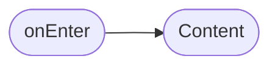
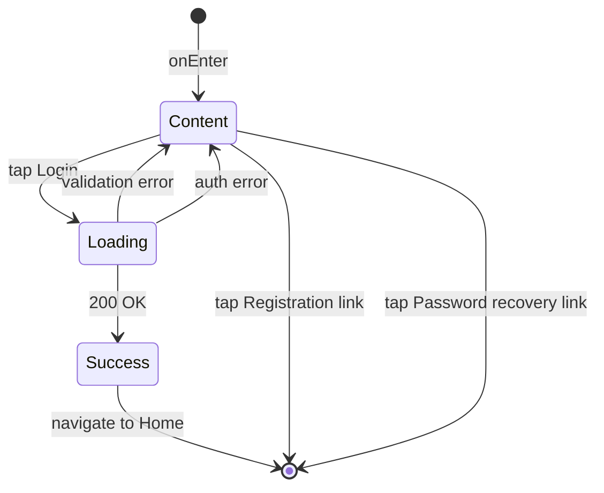

# Экран входа

**ID:** SCR-002  
**Тип:** Экран  
**Домен:** 01. Аутентификация  
**Приоритет:** High  
**Статус:** Актуален  
**Функциональные блоки:** FB-AUTH-001, FB-PROFILE-001  
**Зона авторизации:** НЗ  
**Дизайн-макет:**

---

## Содержание

- [История изменений](#история-изменений)
- [Обзор](#обзор)
- [Навигация](#навигация)
- [Входные данные](#входные-данные)
- [Применяемые логики](#применяемые-логики)
- [Инициализация](#инициализация)
- [Используемые запросы](#используемые-запросы)
- [Макет экрана](#макет-экрана)
- [Элементы экрана](#элементы-экрана)
- [Состояния экрана](#состояния-экрана)
- [Действия пользователя](#действия-пользователя)
- [Связанные требования](#связанные-требования)
- [Критерии приёмки](#критерии-приёмки)

---

## История изменений

| Релиз | ТЗ | Описание изменений |
|-------|-----|-------------------|
| 1.0.0 | [ТЗ на аутентификацию](../conclusion-overview.md) | Создание спецификации экрана входа |

---

## Обзор

Экран входа позволяет зарегистрированным пользователям войти в свое аккаунт в приложении "Кулинарная студия", используя свои учетные данные (email и пароль).

### User Story

> Как зарегистрированный пользователь, я хочу войти в приложение,
> чтобы получить доступ к своим данным и возможностям сервиса.

### Бизнес-ценность

- Обеспечение безопасности данных пользователей
- Возможность персонализации сервиса
- Поддержка повторного использования приложения

---

## Навигация

### Входящая (откуда открывается)

| Источник | Триггер | Условие | Передаваемые параметры |
|----------|---------|---------|------------------------|
| [Registration Screen](registration-screen-spec.md) | Тап на ссылку "Войти" | Всегда | — |
| Глубокая ссылка | `app://login` | Всегда | — |

### Исходящая (куда ведёт)

| Назначение | Триггер | Передаваемые параметры |
|------------|---------|------------------------|
| [Home Screen](home-screen-spec.md) | Успешный вход | `{token}`, `{clientInfo}` |
| [Registration Screen](registration-screen-spec.md) | Тап на ссылку "Регистрация" | — |
| [Password Recovery Screen](#) | Тап на ссылку "Забыли пароль?" | — |

---

## Входные данные

| Название | Тип | Возможные значения | Описание |
|----------|-----|-------------------|----------|
| `{cacheState}` | Кэш | `{empty}`, `{hasData}` | Состояние кэша перед входом |

---

## Применяемые логики

| Логика | Элемент/Триггер | Описание |
|--------|-----------------|----------|
| [Auth Logic](auth-logic-spec.md) | Кнопка "Войти" | Обработка процесса аутентификации и получения токена |

---

## Инициализация

### Диаграмма загрузки



### Запросы при открытии

| № | Запрос | Критичный | Зависит от | Условие |
|---|--------|-----------|------------|---------|
| 1 | — | — | — | Всегда |

> Экран не требует загрузки данных при открытии.

---

## Используемые запросы

### /auth/login

**Тип:** REST  
**Метод:** POST  
**Спецификация:** [openapi-spec-final.yaml](../../api/openapi-spec-final.yaml) → `auth.login`

**Триггер:** Тап на кнопку "Войти"

**Параметры:**

| Параметр | Тип | Обязательность | Источник | Описание |
|----------|-----|----------------|----------|----------|
| `email` | string | Да | Поле ввода email | Email пользователя |
| `password` | string | Да | Поле ввода пароля | Пароль пользователя |

**Обработка ответа:**

| Результат | Условие | UI-реакция |
|-----------|---------|------------|
| Загрузка | — | Лоадер на кнопке, блокировка UI |
| Успех (200) | Вход успешен | Переход на Home Screen с токеном |
| HTTP 401 | Неверные учетные данные | Снек "Неверный email или пароль" |
| HTTP 5xx | — | Снек "Произошла ошибка. Попробуйте позже" |
| Сеть | Нет соединения | Снек "Нет соединения. Проверьте подключение" |

---

**Доступные спецификации:**

REST API (`api/`):
- `openapi-spec-final.yaml` — основная схема API

---

## Макет экрана

### Структура

```
┌─────────────────────────────────────┐
│                Вход                │  ← Заголовок
├─────────────────────────────────────┤
│                                     │
│           Поля ввода данных         │  ← Scrollable
│            (email, пароль)          │
│                                     │
├─────────────────────────────────────┤
│             [Войти]                 │  ← Основная кнопка
├─────────────────────────────────────┤
│    Забыли пароль? [Восстановить]    │  ← Ссылка
│     Нет аккаунта? [Регистрация]     │  ← Ссылка
└─────────────────────────────────────┘
```

### Компоненты

| Компонент | Описание | Обязательность |
|-----------|----------|----------------|
| Поле ввода email | Поле для ввода электронной почты | Да |
| Поле ввода пароля | Поле для ввода пароля | Да |
| Кнопка входа | Кнопка для отправки данных | Да |
| Ссылка на восстановление пароля | Ссылка для восстановления пароля | Опционально |
| Ссылка на регистрацию | Ссылка для перехода на регистрацию | Да |

---

## Элементы экрана

### 1. Блок ввода данных

| Элемент | Описание | Источник данных | Валидация | Действие |
|---------|----------|-----------------|-----------|----------|
| Поле "Email*" | Электронная почта | Ввод пользователя | Корректный email. Ошибка: "Email имеет неверный формат" | — |
| Поле "Пароль*" | Пароль пользователя | Ввод пользователя | Минимум 1 символ. Ошибка: "Пароль не может быть пустым" | — |
| Кнопка "Войти" | Основная кнопка | — | — | Валидация → [/auth/login](#authlogin) |
| Ссылка "Забыли пароль?" | Ссылка на восстановление | — | — | — |
| Ссылка "Регистрация" | Ссылка на регистрацию | — | — | — |

**Момент валидации:** При тапе на кнопку "Войти"

**Логика:**
- Кнопка "Войти": При тапе → валидация всех полей → при успехе отправить запрос [/auth/login](#authlogin)

**Условия доступности:**
- Кнопка "Войти" активна, если: все обязательные поля заполнены И валидация пройдена

---

## Состояния экрана

### Таблица состояний

| Состояние | Условие | Отображение |
|-----------|---------|-------------|
| Content | Всегда | Стандартный контент с полями ввода |
| Loading | При отправке запроса | Лоадер на кнопке, блокировка UI |
| Error | Ошибка валидации | Сообщения об ошибках под полями ввода |
| Error | Ошибка аутентификации | Сообщение "Неверный email или пароль" |

### Диаграмма переходов



---

## Действия пользователя

| Действие | Элемент | Триггер | Результат |
|----------|---------|---------|-----------|
| Ввод email | Поле "Email" | Input | Сохранение значения |
| Ввод пароля | Поле "Пароль" | Input | Сохранение значения |
| Вход в систему | Кнопка "Войти" | Tap | Валидация и отправка запроса |
| Восстановление пароля | Ссылка "Забыли пароль?" | Tap | Переход на экран восстановления |
| Регистрация | Ссылка "Регистрация" | Tap | Переход на [Registration Screen](registration-screen-spec.md) |

---

## Связанные требования

### Функциональные (REQ-FUNC-*)

| ID | Название | Приоритет |
|----|----------|-----------|
| REQ-FUNC-003 | Аутентификация пользователя | High |
| REQ-FUNC-004 | Валидация данных при входе | Medium |

### Интеграции (REQ-INT-*)

| ID | Название | Приоритет |
|----|----------|-----------|
| REQ-INT-002 | Интеграция с /auth/login | High |

### UI (REQ-UI-*)

| ID | Название | Приоритет |
|----|----------|-----------|
| REQ-UI-003 | Адаптивный дизайн формы входа | Medium |
| REQ-UI-004 | Отображение ошибок аутентификации | Medium |

### Данные (REQ-DATA-*)

| ID | Название | Приоритет |
|----|----------|-----------|
| REQ-DATA-002 | Хранение временных данных формы | Low |

---

## Критерии приёмки

### Позитивные сценарии

| ID | Критерий | Приоритет |
|----|----------|-----------|
| AC-001 | **Дано** пользователь на экране входа, **Когда** вводит корректные учетные данные и нажимает "Войти", **Тогда** происходит успешный вход и переход на главный экран | P0 |
| AC-002 | **Дано** пользователь незарегистрирован, **Когда** нажимает на ссылку "Регистрация", **Тогда** переходит на экран регистрации | P0 |

### Негативные сценарии

| ID | Критерий | Приоритет |
|----|----------|-----------|
| AC-N01 | **Дано** ошибка сети, **Когда** отправка формы входа, **Тогда** отображается сообщение об ошибке | P0 |
| AC-N02 | **Дано** неверные учетные данные, **Когда** отправка формы, **Тогда** отображается сообщение об ошибке аутентификации | P0 |

### Граничные условия (Edge Cases)

| ID | Критерий | Приоритет |
|----|----------|-----------|
| AC-E01 | **Дано** текст в полях > лимита символов, **Когда** ввод, **Тогда** ограничение ввода | P1 |
| AC-E02 | **Дано** потеря сети во время запроса, **Когда** восстановление, **Тогда** возможность повторной попытки | P2 |