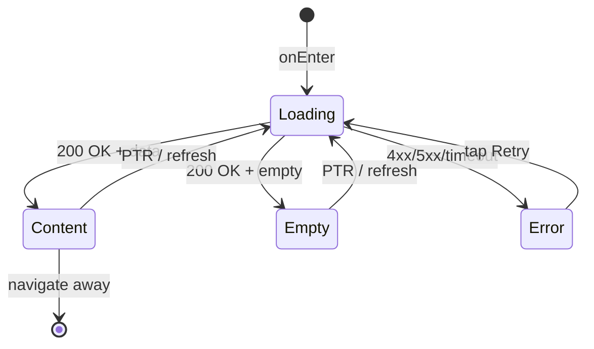

# Экран "Мои бронирования"

**ID:** SCR-007  
**Тип:** Экран  
**Домен:** 06. Мои бронирования  
**Приоритет:** High  
**Статус:** Актуален  
**Функциональные блоки:** FB-BOOKINGS-001, FB-REVIEWS-001  
**Зона авторизации:** АЗ  
**Дизайн-макет:**

---

## Содержание

- [История изменений](#история-изменений)
- [Обзор](#обзор)
- [Навигация](#навигация)
- [Входные данные](#входные-данные)
- [Применяемые логики](#применяемые-логики)
- [Инициализация](#инициализация)
- [Используемые запросы](#используемые-запросы)
- [Макет экрана](#макет-экрана)
- [Элементы экрана](#элементы-экрана)
- [Состояния экрана](#состояния-экрана)
- [Действия пользователя](#действия-пользователя)
- [Связанные требования](#связанные-требования)
- [Критерии приёмки](#критерии-приёмки)

---

## История изменений

| Релиз | ТЗ | Описание изменений |
|-------|-----|-------------------|
| 1.0.0 | [ТЗ на экран моих бронирований](../conclusion-overview.md) | Создание спецификации экрана моих бронирований |

---

## Обзор

Экран "Мои бронирования" отображает список текущих и прошедших бронирований пользователя, позволяет просматривать детали бронирования, отменять предстоящие бронирования и оставлять отзывы о шефах после посещения классов.

### User Story

> Как пользователь, я хочу видеть список своих бронирований,
> чтобы отслеживать предстоящие и прошедшие посещения классов.

### Бизнес-ценность

- Повышение прозрачности для пользователей
- Упрощение управления бронированиями
- Сбор обратной связи через отзывы

---

## Навигация

### Входящая (откуда открывается)

| Источник | Триггер | Условие | Передаваемые параметры |
|----------|---------|---------|------------------------|
| [Bottom Navigation](#) | Тап на иконку "Мои бронирования" | Всегда | — |
| [Booking Screen](booking-screen-spec.md) | Успешное бронирование | Всегда | — |
| Deep link | `app://my-bookings` | Всегда | — |

### Исходящая (куда ведёт)

| Назначение | Триггер | Передаваемые параметры |
|------------|---------|------------------------|
| [Booking Detail Screen](#) | Тап на бронирование | `{bookingId}` |
| [Review Creation Screen](#) | Тап на "Оценить шефа" | `{bookingId}`, `{chefId}` |
| [Class Detail Screen](class-detail-screen-spec.md) | Тап на класс в бронировании | `{classId}` |

---

## Входные данные

| Название | Тип | Возможные значения | Описание |
|----------|-----|-------------------|----------|
| `{token}` | Защищённое хранилище | `{validJWT}` | Токен аутентификации пользователя |
| `{filterStatus}` | Состояние | `{all, upcoming, past, cancelled}` | Фильтр по статусу бронирования |

---

## Применяемые логики

| Логика | Элемент/Триггер | Описание |
|--------|-----------------|----------|
| [Booking Logic](booking-logic-spec.md) | Загрузка и фильтрация бронирований | Получение списка бронирований и применение фильтров |
| [Cancellation Logic](#) | Отмена бронирования | Обработка запроса на отмену бронирования |

---

## Инициализация

### Диаграмма загрузки

```mermaid
flowchart LR
    Start([onEnter]) --> P1[/bookings]
    
    P1 --> Ready([Content])
```

### Запросы при открытии

| № | Запрос | Критичный | Зависит от | Условие |
|---|--------|-----------|------------|---------|
| 1 | [/bookings](#bookings) | Да | — | Всегда |

> Полное описание запросов см. в секции [Используемые запросы](#используемые-запросы).

---

## Используемые запросы

### /bookings

**Тип:** REST  
**Метод:** GET  
**Спецификация:** [openapi-spec-final.yaml](../../api/openapi-spec-final.yaml) → `bookings.get`

**Триггер:** Инициализация и обновление

**Headers:**

| Поле | Описание |
|------|----------|
| `authorization` | Bearer токен пользователя |

**Параметры:**

| Параметр | Тип | Обязательность | Источник | Описание |
|----------|-----|----------------|----------|----------|
| `status` | string | Нет | `{filterStatus}` | Фильтр по статусу бронирования |

**Обработка ответа:**

| Результат | Условие | UI-реакция |
|-----------|---------|------------|
| Загрузка | — | Скелетон / Шиммер списка |
| Успех (200) | `data` не пуст | Отобразить список бронирований |
| Успех (200) | `data` пуст | Empty state с сообщением "Нет бронирований" |
| HTTP 4xx | — | Error state с кнопкой "Обновить" |
| HTTP 5xx | — | Error state с кнопкой "Обновить" |
| Сеть | Нет соединения | Error state с кнопкой "Обновить" |

---

### /bookings/{bookingId}

**Тип:** REST  
**Метод:** PUT  
**Спецификация:** [openapi-spec-final.yaml](../../api/openapi-spec-final.yaml) → `bookings.update`

**Триггер:** Отмена бронирования

**Headers:**

| Поле | Описание |
|------|----------|
| `authorization` | Bearer токен пользователя |

**Параметры:**

| Параметр | Тип | Обязательность | Источник | Описание |
|----------|-----|----------------|----------|----------|
| `bookingId` | string | Да | Выбор пользователя | ID бронирования |
| `action` | string | Да | — | Действие ("cancel") |
| `reason` | string | Нет | Ввод пользователя | Причина отмены |

**Обработка ответа:**

| Результат | Условие | UI-реакция |
|-----------|---------|------------|
| Загрузка | — | Лоадер на кнопке, блокировка UI |
| Успех (200) | Бронирование обновлено | Обновление списка бронирований |
| HTTP 400 | Невозможно отменить (слишком поздно) | Снек с текстом из `message` |
| HTTP 401 | Неавторизованный доступ | Переход на экран входа |
| HTTP 404 | Бронирование не найдено | Снек с сообщением об ошибке |
| HTTP 5xx | — | Снек "Произошла ошибка. Попробуйте позже" |
| Сеть | Нет соединения | Снек "Нет соединения. Проверьте подключение" |

---

**Доступные спецификации:**

REST API (`api/`):
- `openapi-spec-final.yaml` — основная схема API

---

## Макет экрана

### Структура

```
┌─────────────────────────────────────┐
│ [←] Мои бронирования     [Фильтр]  │  ← Header
├─────────────────────────────────────┤
│                                     │
│         Панель фильтров             │  ← Scrollable
│    (все, предстоящие, прошедшие)    │
│                                     │
├─────────────────────────────────────┤
│                                     │
│         Список бронирований         │  ← Scrollable
│                                     │
└─────────────────────────────────────┘
```

### Компоненты

| Компонент | Описание | Обязательность |
|-----------|----------|----------------|
| Панель фильтров | Фильтры по статусу бронирования | Да |
| Список бронирований | Отображение всех бронирований | Да |
| Карточка бронирования | Информация о конкретном бронировании | Да |
| Кнопка отмены | Для отмены бронирования | Условно |

---

## Элементы экрана

### 1. Панель фильтров

| Элемент | Описание | Источник данных | Валидация | Действие |
|---------|----------|-----------------|-----------|----------|
| Фильтр "Все" | Показать все бронирования | — | — | Применить фильтр |
| Фильтр "Предстоящие" | Показать будущие бронирования | — | — | Применить фильтр |
| Фильтр "Прошедшие" | Показать завершенные бронирования | — | — | Применить фильтр |
| Фильтр "Отмененные" | Показать отмененные бронирования | — | — | Применить фильтр |

**Логика:**
- Фильтры: При выборе фильтра → обновление списка бронирований с новыми параметрами

### 2. Список бронирований

| Элемент | Описание | Источник данных | Валидация | Действие |
|---------|----------|-----------------|-----------|----------|
| Карточка бронирования | Информация о бронировании | `/bookings` | — | Тап → детали бронирования |
| Статус бронирования | Индикатор статуса | `/bookings` | — | — |
| Дата и время | Время бронирования | `/bookings` | — | — |
| Название класса | Название забронированного класса | `/bookings` | — | — |
| Кнопка отмены | Для отмены бронирования | `/bookings` | — | Отменить бронирование |
| Кнопка "Оценить шефа" | Для оценки шефа после класса | `/bookings` | — | Оставить отзыв |

**Логика:**
- Карточка бронирования: [Booking Logic](booking-logic-spec.md) — отображение информации о бронировании и статусе

**Условия доступности:**
- Кнопка отмены: Доступна для предстоящих бронирований (до 24 часов до начала)
- Кнопка "Оценить шефа": Доступна для завершенных бронирований

---

## Состояния экрана

### Таблица состояний

| Состояние | Условие | Отображение |
|-----------|---------|-------------|
| Loading | Ожидание API | Скелетон-шиммер для списка |
| Content | API 200 + данные | Стандартный контент со списком бронирований |
| Empty | API 200 + нет бронирований | Empty state с сообщением "Нет бронирований" |
| Error | API 4xx/5xx | Error state с кнопкой "Обновить" |

### Диаграмма переходов



---

## Действия пользователя

| Действие | Элемент | Триггер | Результат |
|----------|---------|---------|-----------|
| Применение фильтров | Панель фильтров | Tap на фильтр | Обновление списка бронирований |
| Просмотр бронирования | Карточка бронирования | Tap | Переход к деталям бронирования |
| Отмена бронирования | Кнопка отмены | Tap | Подтверждение и отмена бронирования |
| Оценка шефа | Кнопка "Оценить шефа" | Tap | Переход к форме отзыва |
| Обновление | Pull to refresh | Pull down | Обновление данных |

---

## Связанные требования

### Функциональные (REQ-FUNC-*)

| ID | Название | Приоритет |
|----|----------|-----------|
| REQ-FUNC-017 | Отображение списка бронирований | High |
| REQ-FUNC-018 | Фильтрация бронирований | Medium |
| REQ-FUNC-019 | Отмена бронирования | Medium |

### Интеграции (REQ-INT-*)

| ID | Название | Приоритет |
|----|----------|-----------|
| REQ-INT-012 | Интеграция с /bookings | High |
| REQ-INT-013 | Интеграция с /bookings/{bookingId} | Medium |

### UI (REQ-UI-*)

| ID | Название | Приоритет |
|----|----------|-----------|
| REQ-UI-013 | Адаптивный дизайн списка бронирований | Medium |
| REQ-UI-014 | Индикаторы статусов бронирований | Medium |

### Данные (REQ-DATA-*)

| ID | Название | Приоритет |
|----|----------|-----------|
| REQ-DATA-011 | Кэширование списка бронирований | Medium |
| REQ-DATA-012 | Сохранение выбранных фильтров | Low |

---

## Критерии приёмки

### Позитивные сценарии

| ID | Критерий | Приоритет |
|----|----------|-----------|
| AC-001 | **Дано** пользователь на экране моих бронирований, **Когда** открывает экран, **Тогда** видит список своих бронирований | P0 |
| AC-002 | **Дано** пользователь выбирает фильтр, **Когда** применяет его, **Тогда** список бронирований фильтруется | P0 |

### Негативные сценарии

| ID | Критерий | Приоритет |
|----|----------|-----------|
| AC-N01 | **Дано** ошибка сети, **Когда** открытие экрана бронирований, **Тогда** отображается error state с кнопкой "Обновить" | P0 |
| AC-N02 | **Дано** нет бронирований, **Когда** открытие экрана, **Тогда** отображается empty state | P1 |

### Граничные условия (Edge Cases)

| ID | Критерий | Приоритет |
|----|----------|-----------|
| AC-E01 | **Дано** много бронирований, **Когда** открытие экрана, **Тогда** реализована постраничная загрузка | P1 |
| AC-E02 | **Дано** потеря сети во время работы, **Когда** восстановление, **Тогда** автоматическое обновление данных | P2 |