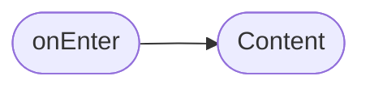
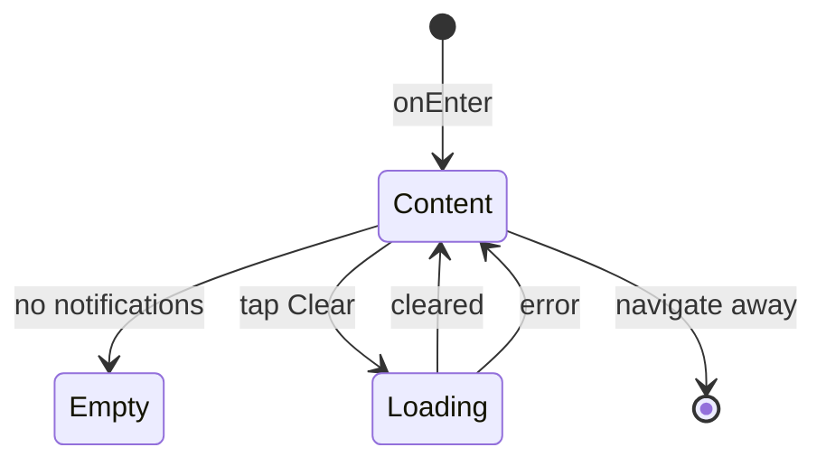

# Экран уведомлений

**ID:** SCR-009  
**Тип:** Экран  
**Домен:** 08. Уведомления  
**Приоритет:** Medium  
**Статус:** Актуален  
**Функциональные блоки:** FB-NOTIFICATIONS-001  
**Зона авторизации:** АЗ  
**Дизайн-макет:**

---

## Содержание

- [История изменений](#история-изменений)
- [Обзор](#обзор)
- [Навигация](#навигация)
- [Входные данные](#входные-данные)
- [Применяемые логики](#применяемые-логики)
- [Инициализация](#инициализация)
- [Используемые запросы](#используемые-запросы)
- [Макет экрана](#макет-экрана)
- [Элементы экрана](#элементы-экрана)
- [Состояния экрана](#состояния-экрана)
- [Действия пользователя](#действия-пользователя)
- [Связанные требования](#связанные-требования)
- [Критерии приёмки](#критерии-приёмки)

---

## История изменений

| Релиз | ТЗ | Описание изменений |
|-------|-----|-------------------|
| 1.0.0 | [ТЗ на экран уведомлений](../conclusion-overview.md) | Создание спецификации экрана уведомлений |

---

## Обзор

Экран уведомлений отображает список полученных уведомлений для пользователя, позволяет просматривать их содержание, очищать список и настраивать параметры уведомлений. Хотя основная логика уведомлений может быть реализована на уровне UI, этот экран предоставляет централизованный способ просмотра истории уведомлений.

### User Story

> Как пользователь, я хочу видеть историю полученных уведомлений,
> чтобы быть в курсе важных событий и напоминаний от приложения.

### Бизнес-ценность

- Повышение вовлеченности пользователей
- Улучшение коммуникации с пользователями
- Предоставление доступа к истории важных событий

---

## Навигация

### Входящая (откуда открывается)

| Источник | Триггер | Условие | Передаваемые параметры |
|----------|---------|---------|------------------------|
| [Bottom Navigation](#) | Тап на иконку "Уведомления" | Всегда | — |
| [Header](#) | Тап на иконку уведомлений | Всегда | — |
| Push-уведомление | Тап на уведомление | Тип = notification_list | — |
| Deep link | `app://notifications` | Всегда | — |

### Исходящая (куда ведёт)

| Назначение | Триггер | Передаваемые параметры |
|------------|---------|------------------------|
| [Class Detail Screen](class-detail-screen-spec.md) | Тап на уведомление о классе | `{classId}` |
| [Booking Detail](my-bookings-screen-spec.md) | Тап на уведомление о бронировании | `{bookingId}` |

---

## Входные данные

| Название | Тип | Возможные значения | Описание |
|----------|-----|-------------------|----------|
| `{token}` | Защищённое хранилище | `{validJWT}` | Токен аутентификации пользователя |
| `{notificationFilter}` | Состояние | `{all, unread, read}` | Фильтр по статусу уведомлений |

---

## Применяемые логики

| Логика | Элемент/Триггер | Описание |
|--------|-----------------|----------|
| [Notification Logic](#) | Загрузка и фильтрация уведомлений | Получение списка уведомлений и применение фильтров |
| [Notification Management Logic](#) | Управление уведомлениями | Обработка действий с уведомлениями |

---

## Инициализация

### Диаграмма загрузки



### Запросы при открытии

| № | Запрос | Критичный | Зависит от | Условие |
|---|--------|-----------|------------|---------|
| 1 | — | — | — | Всегда |

> Экран использует локально сохраненные уведомления, но может интегрироваться с API в будущем.

---

## Используемые запросы

### /notifications (предполагаемый endpoint)

**Тип:** REST  
**Метод:** GET  
**Спецификация:** [openapi-spec-final.yaml](../../api/openapi-spec-final.yaml) → `(в будущем)`

**Триггер:** Инициализация (если будет реализовано серверное хранение)

**Headers:**

| Поле | Описание |
|------|----------|
| `authorization` | Bearer токен пользователя |

**Параметры:**

| Параметр | Тип | Обязательность | Источник | Описание |
|----------|-----|----------------|----------|----------|
| `limit` | integer | Нет | — | Количество уведомлений |
| `offset` | integer | Нет | — | Смещение для пагинации |

**Обработка ответа:**

| Результат | Условие | UI-реакция |
|-----------|---------|------------|
| Загрузка | — | Скелетон / Шиммер списка |
| Успех (200) | `data` не пуст | Отобразить список уведомлений |
| Успех (200) | `data` пуст | Empty state с сообщением "Нет уведомлений" |
| HTTP 4xx | — | Error state с кнопкой "Обновить" |
| HTTP 5xx | — | Error state с кнопкой "Обновить" |
| Сеть | Нет соединения | Использовать локальные данные |

---

### /notifications/clear (предполагаемый endpoint)

**Тип:** REST  
**Метод:** DELETE  
**Спецификация:** [openapi-spec-final.yaml](../../api/openapi-spec-final.yaml) → `(в будущем)`

**Триггер:** Тап на кнопку "Очистить уведомления"

**Headers:**

| Поле | Описание |
|------|----------|
| `authorization` | Bearer токен пользователя |

**Параметры:**

| Параметр | Тип | Обязательность | Источник | Описание |
|----------|-----|----------------|----------|----------|

**Обработка ответа:**

| Результат | Условие | UI-реакция |
|-----------|---------|------------|
| Загрузка | — | Лоадер на кнопке |
| Успех (200) | Уведомления очищены | Очистка списка уведомлений |
| HTTP 4xx | — | Снек с текстом из `message` |
| HTTP 5xx | — | Снек "Произошла ошибка. Попробуйте позже" |
| Сеть | Нет соединения | Очистка локального списка |

---

**Доступные спецификации:**

REST API (`api/`):
- `openapi-spec-final.yaml` — основная схема API

---

## Макет экрана

### Структура

```
┌─────────────────────────────────────┐
│ [←] Уведомления        [Настройки] │  ← Header
├─────────────────────────────────────┤
│                                     │
│         Панель фильтров             │  ← Scrollable
│    (все, прочитанные, непрочит.)    │
│                                     │
├─────────────────────────────────────┤
│                                     │
│        Список уведомлений           │  ← Scrollable
│                                     │
├─────────────────────────────────────┤
│      [Очистить уведомления]         │  ← Кнопка внизу
└─────────────────────────────────────┘
```

### Компоненты

| Компонент | Описание | Обязательность |
|-----------|----------|----------------|
| Панель фильтров | Фильтры по статусу уведомлений | Да |
| Список уведомлений | Отображение всех уведомлений | Да |
| Карточка уведомления | Информация о конкретном уведомлении | Да |
| Кнопка очистки | Для очистки списка уведомлений | Да |

---

## Элементы экрана

### 1. Панель фильтров

| Элемент | Описание | Источник данных | Валидация | Действие |
|---------|----------|-----------------|-----------|----------|
| Фильтр "Все" | Показать все уведомления | — | — | Применить фильтр |
| Фильтр "Непрочитанные" | Показать непрочитанные уведомления | — | — | Применить фильтр |
| Фильтр "Прочитанные" | Показать прочитанные уведомления | — | — | Применить фильтр |

**Логика:**
- Фильтры: При выборе фильтра → обновление списка уведомлений с новыми параметрами

### 2. Список уведомлений

| Элемент | Описание | Источник данных | Валидация | Действие |
|---------|----------|-----------------|-----------|----------|
| Карточка уведомления | Информация о уведомлении | Локальные данные | — | Тап → действие по уведомлению |
| Заголовок уведомления | Тема уведомления | Локальные данные | — | — |
| Текст уведомления | Основной текст уведомления | Локальные данные | — | — |
| Дата уведомления | Время получения уведомления | Локальные данные | — | — |
| Индикатор прочтения | Статус прочтения уведомления | Локальные данные | — | — |

**Логика:**
- Карточка уведомления: При тапе → пометка как прочитанное + выполнение действия уведомления

### 3. Кнопка "Очистить уведомления"

| Элемент | Описание | Источник данных | Валидация | Действие |
|---------|----------|-----------------|-----------|----------|
| Кнопка "Очистить" | Очистка списка уведомлений | — | — | Подтверждение и очистка |

**Логика:**
- Кнопка "Очистить": При тапе → подтверждение действия → очистка списка уведомлений

**Условия доступности:**
- Кнопка "Очистить" активна, если: список уведомлений не пуст

---

## Состояния экрана

### Таблица состояний

| Состояние | Условие | Отображение |
|-----------|---------|-------------|
| Content | Всегда | Стандартный контент со списком уведомлений |
| Empty | Нет уведомлений | Empty state с сообщением "Нет уведомлений" |
| Loading | При очистке уведомлений | Лоадер на кнопке |

### Диаграмма переходов



---

## Действия пользователя

| Действие | Элемент | Триггер | Результат |
|----------|---------|---------|-----------|
| Применение фильтров | Панель фильтров | Tap на фильтр | Обновление списка уведомлений |
| Просмотр уведомления | Карточка уведомления | Tap | Отметка как прочитанное + действие |
| Очистка уведомлений | Кнопка "Очистить" | Tap | Подтверждение и очистка списка |
| Обновление | Pull to refresh | Pull down | Обновление данных (в будущем) |

---

## Связанные требования

### Функциональные (REQ-FUNC-*)

| ID | Название | Приоритет |
|----|----------|-----------|
| REQ-FUNC-023 | Отображение списка уведомлений | Medium |
| REQ-FUNC-024 | Фильтрация уведомлений | Low |
| REQ-FUNC-025 | Очистка уведомлений | Low |

### Интеграции (REQ-INT-*)

| ID | Название | Приоритет |
|----|----------|-----------|
| REQ-INT-017 | Интеграция с /notifications (в будущем) | Low |
| REQ-INT-018 | Интеграция с /notifications/clear (в будущем) | Low |

### UI (REQ-UI-*)

| ID | Название | Приоритет |
|----|----------|-----------|
| REQ-UI-017 | Адаптивный дизайн списка уведомлений | Medium |
| REQ-UI-018 | Индикаторы статуса уведомлений | Low |

### Данные (REQ-DATA-*)

| ID | Название | Приоритет |
|----|----------|-----------|
| REQ-DATA-015 | Локальное хранение уведомлений | Medium |
| REQ-DATA-016 | Сохранение выбранных фильтров | Low |

---

## Критерии приёмки

### Позитивные сценарии

| ID | Критерий | Приоритет |
|----|----------|-----------|
| AC-001 | **Дано** пользователь на экране уведомлений, **Когда** открывает экран, **Тогда** видит список своих уведомлений | P0 |
| AC-002 | **Дано** пользователь выбирает фильтр, **Когда** применяет его, **Тогда** список уведомлений фильтруется | P1 |

### Негативные сценарии

| ID | Критерий | Приоритет |
|----|----------|-----------|
| AC-N01 | **Дано** нет уведомлений, **Когда** открытие экрана, **Тогда** отображается empty state | P1 |
| AC-N02 | **Дано** ошибка при очистке, **Когда** попытка очистки, **Тогда** отображается сообщение об ошибке | P2 |

### Граничные условия (Edge Cases)

| ID | Критерий | Приоритет |
|----|----------|-----------|
| AC-E01 | **Дано** много уведомлений, **Когда** открытие экрана, **Тогда** реализована постраничная загрузка | P2 |
| AC-E02 | **Дано** потеря сети, **Когда** работа с уведомлениями, **Тогда** использование локальных данных | P2 |