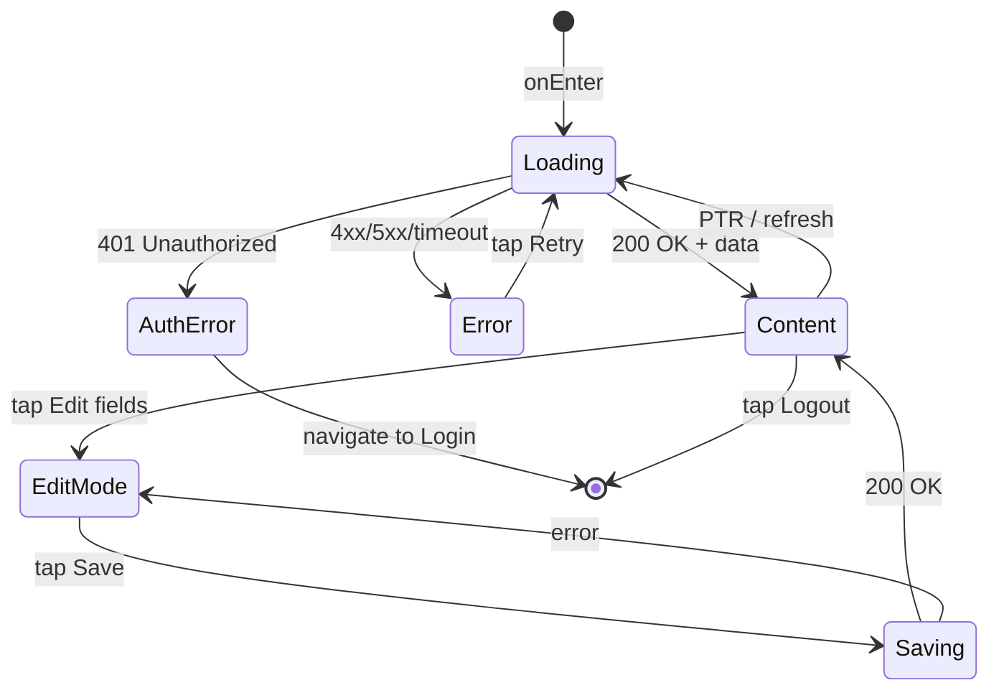

# Экран профиля

**ID:** SCR-008  
**Тип:** Экран  
**Домен:** 07. Профиль  
**Приоритет:** High  
**Статус:** Актуален  
**Функциональные блоки:** FB-PROFILE-001, FB-AUTH-001  
**Зона авторизации:** АЗ  
**Дизайн-макет:**

---

## Содержание

- [История изменений](#история-изменений)
- [Обзор](#обзор)
- [Навигация](#навигация)
- [Входные данные](#входные-данные)
- [Применяемые логики](#применяемые-логики)
- [Инициализация](#инициализация)
- [Используемые запросы](#используемые-запросы)
- [Макет экрана](#макет-экрана)
- [Элементы экрана](#элементы-экрана)
- [Состояния экрана](#состояния-экрана)
- [Действия пользователя](#действия-пользователя)
- [Связанные требования](#связанные-требования)
- [Критерии приёмки](#критерии-приёмки)

---

## История изменений

| Релиз | ТЗ | Описание изменений |
|-------|-----|-------------------|
| 1.0.0 | [ТЗ на экран профиля](../conclusion-overview.md) | Создание спецификации экрана профиля |

---

## Обзор

Экран профиля позволяет пользователю просматривать и редактировать свою личную информацию, включая имя, email, телефон, информацию об аллергиях, а также отображает статус постоянного клиента. Также предоставляет возможность выйти из аккаунта.

### User Story

> Как пользователь, я хочу просматривать и редактировать свои
> личные данные, чтобы поддерживать актуальную информацию в профиле.

### Бизнес-ценность

- Повышение точности данных пользователей
- Улучшение персонализации сервиса
- Сбор важной информации (аллергии) для безопасности участников

---

## Навигация

### Входящая (откуда открывается)

| Источник | Триггер | Условие | Передаваемые параметры |
|----------|---------|---------|------------------------|
| [Bottom Navigation](#) | Тап на иконку "Профиль" | Всегда | — |
| [Header](#) | Тап на аватар/имя в шапке | Всегда | — |
| Deep link | `app://profile` | Всегда | — |

### Исходящая (куда ведёт)

| Назначение | Триггер | Передаваемые параметры |
|------------|---------|------------------------|
| [Login Screen](login-screen-spec.md) | Выход из аккаунта | — |
| [Notifications Screen](notifications-screen-spec.md) | Тап на настройки уведомлений | — |

---

## Входные данные

| Название | Тип | Возможные значения | Описание |
|----------|-----|-------------------|----------|
| `{token}` | Защищённое хранилище | `{validJWT}` | Токен аутентификации пользователя |

---

## Применяемые логики

| Логика | Элемент/Триггер | Описание |
|--------|-----------------|----------|
| [Profile Logic](auth-logic-spec.md) | Загрузка и обновление профиля | Получение и сохранение данных профиля |
| [Auth Logic](auth-logic-spec.md) | Выход из аккаунта | Обработка процесса логаута |

---

## Инициализация

### Диаграмма загрузки

```mermaid
flowchart LR
    Start([onEnter]) --> P1[/profile]
    
    P1 --> Ready([Content])
```

### Запросы при открытии

| № | Запрос | Критичный | Зависит от | Условие |
|---|--------|-----------|------------|---------|
| 1 | [/profile](#profile) | Да | — | Всегда |

> Полное описание запросов см. в секции [Используемые запросы](#используемые-запросы).

---

## Используемые запросы

### /profile (GET)

**Тип:** REST  
**Метод:** GET  
**Спецификация:** [openapi-spec-final.yaml](../../api/openapi-spec-final.yaml) → `profile.get`

**Триггер:** Инициализация

**Headers:**

| Поле | Описание |
|------|----------|
| `authorization` | Bearer токен пользователя |

**Параметры:**

| Параметр | Тип | Обязательность | Источник | Описание |
|----------|-----|----------------|----------|----------|

**Обработка ответа:**

| Результат | Условие | UI-реакция |
|-----------|---------|------------|
| Загрузка | — | Скелетон / Шиммер блоков |
| Успех (200) | Данные получены | Заполнение полей профиля |
| HTTP 401 | Неавторизованный доступ | Переход на экран входа |
| HTTP 4xx | — | Error state с кнопкой "Обновить" |
| HTTP 5xx | — | Error state с кнопкой "Обновить" |
| Сеть | Нет соединения | Error state с кнопкой "Обновить" |

---

### /profile (PUT)

**Тип:** REST  
**Метод:** PUT  
**Спецификация:** [openapi-spec-final.yaml](../../api/openapi-spec-final.yaml) → `profile.update`

**Триггер:** Сохранение изменений профиля

**Headers:**

| Поле | Описание |
|------|----------|
| `authorization` | Bearer токен пользователя |

**Параметры:**

| Параметр | Тип | Обязательность | Источник | Описание |
|----------|-----|----------------|----------|----------|
| `firstName` | string | Нет | Поле ввода | Имя пользователя |
| `lastName` | string | Нет | Поле ввода | Фамилия пользователя |
| `phone` | string | Нет | Поле ввода | Номер телефона |
| `allergies` | string | Нет | Поле ввода | Информация об аллергиях |

**Обработка ответа:**

| Результат | Условие | UI-реакция |
|-----------|---------|------------|
| Загрузка | — | Лоадер на кнопке, блокировка UI |
| Успех (200) | Профиль обновлен | Сообщение об успехе, обновление UI |
| HTTP 400 | Невалидные данные | Снек с текстом из `message` |
| HTTP 401 | Неавторизованный доступ | Переход на экран входа |
| HTTP 5xx | — | Снек "Произошла ошибка. Попробуйте позже" |
| Сеть | Нет соединения | Снек "Нет соединения. Проверьте подключение" |

---

### /auth/logout

**Тип:** REST  
**Метод:** POST  
**Спецификация:** [openapi-spec-final.yaml](../../api/openapi-spec-final.yaml) → `auth.logout`

**Триггер:** Тап на кнопку "Выйти из аккаунта"

**Headers:**

| Поле | Описание |
|------|----------|
| `authorization` | Bearer токен пользователя |

**Параметры:**

| Параметр | Тип | Обязательность | Источник | Описание |
|----------|-----|----------------|----------|----------|

**Обработка ответа:**

| Результат | Условие | UI-реакция |
|-----------|---------|------------|
| Загрузка | — | Лоадер на кнопке |
| Успех (200) | Успешный logout | Очистка токена, переход на Login Screen |
| HTTP 401 | Неавторизованный доступ | Очистка токена, переход на Login Screen |
| HTTP 5xx | — | Снек "Произошла ошибка. Попробуйте позже" |
| Сеть | Нет соединения | Снек "Нет соединения. Проверьте подключение" |

---

**Доступные спецификации:**

REST API (`api/`):
- `openapi-spec-final.yaml` — основная схема API

---

## Макет экрана

### Структура

```
┌─────────────────────────────────────┐
│ [←] Профиль                        │  ← Header
├─────────────────────────────────────┤
│                                     │
│         Информация о пользователе   │  ← Scrollable
│           (имя, email, телефон)     │
│                                     │
├─────────────────────────────────────┤
│                                     │
│        Информация об аллергиях      │  ← Scrollable
│                                     │
├─────────────────────────────────────┤
│                                     │
│        Статус постоянного клиента   │  ← Scrollable
│                                     │
├─────────────────────────────────────┤
│                                     │
│          Настройки уведомлений      │  ← Scrollable
│                                     │
├─────────────────────────────────────┤
│         [Выйти из аккаунта]         │  ← Кнопка внизу
└─────────────────────────────────────┘
```

### Компоненты

| Компонент | Описание | Обязательность |
|-----------|----------|----------------|
| Информация о пользователе | Имя, email, телефон | Да |
| Поле аллергий | Для указания аллергий | Да |
| Статус постоянного клиента | Индикатор статуса | Да |
| Настройки уведомлений | Переключатель уведомлений | Опционально |
| Кнопка выхода | Для выхода из аккаунта | Да |

---

## Элементы экрана

### 1. Информация о пользователе

| Элемент | Описание | Источник данных | Валидация | Действие |
|---------|----------|-----------------|-----------|----------|
| Поле "Имя" | Имя пользователя | `/profile` | Только буквы, 2-25 символов. Ошибка: "Имя имеет неверный формат" | Редактирование |
| Поле "Email" | Email пользователя | `/profile` | Корректный email. Ошибка: "Email имеет неверный формат" | — |
| Поле "Телефон" | Номер телефона | `/profile` | Формат +7XXXXXXXXX. Ошибка: "Телефон имеет неверный формат" | Редактирование |

**Момент валидации:** При сохранении изменений

**Логика:**
- Поля профиля: Возможность редактирования и сохранения через [/profile PUT](#profile-put)

### 2. Информация об аллергиях

| Элемент | Описание | Источник данных | Валидация | Действие |
|---------|----------|-----------------|-----------|----------|
| Поле "Аллергии" | Информация об аллергиях | `/profile` | — | Редактирование |
| Подсказка | "Укажите аллергии, если они есть" | — | — | — |

**Логика:**
- Поле аллергий: Редактирование и сохранение через [/profile PUT](#profile-put)

### 3. Статус постоянного клиента

| Элемент | Описание | Источник данных | Валидация | Действие |
|---------|----------|-----------------|-----------|----------|
| Статус | "Постоянный клиент: Да/Нет" | `/profile` | — | — |
| Количество посещений | "Посещено классов: N" | `/profile` | — | — |

**Логика:**
- Статус постоянного клиента: Отображение на основе данных из профиля

### 4. Настройки уведомлений

| Элемент | Описание | Источник данных | Валидация | Действие |
|---------|----------|-----------------|-----------|----------|
| Переключатель | "Получать уведомления" | — | — | Переключение настроек |

**Логика:**
- Настройки уведомлений: Локальное сохранение настроек уведомлений

### 5. Кнопка "Выйти из аккаунта"

| Элемент | Описание | Источник данных | Валидация | Действие |
|---------|----------|-----------------|-----------|----------|
| Кнопка "Выйти из аккаунта" | Для завершения сеанса | — | — | [/auth/logout](#authlogout) |

**Логика:**
- Кнопка "Выйти из аккаунта": При тапе → подтверждение → вызов [/auth/logout](#authlogout)

**Условия доступности:**
- Все элементы доступны, если пользователь авторизован

---

## Состояния экрана

### Таблица состояний

| Состояние | Условие | Отображение |
|-----------|---------|-------------|
| Loading | Ожидание API | Скелетон-шиммер для всех блоков |
| Content | API 200 + данные | Стандартный контент с информацией профиля |
| Edit Mode | Редактирование полей | Поля ввода активны, кнопка сохранения |
| Saving | Сохранение изменений | Лоадер на кнопке, блокировка UI |
| Error | API 4xx/5xx | Error state с кнопкой "Обновить" |

### Диаграмма переходов



---

## Действия пользователя

| Действие | Элемент | Триггер | Результат |
|----------|---------|---------|-----------|
| Редактирование профиля | Поля ввода | Input | Изменение данных профиля |
| Сохранение изменений | Кнопка "Сохранить" | Tap | Обновление профиля на сервере |
| Выход из аккаунта | Кнопка "Выйти" | Tap | Завершение сеанса и переход к входу |
| Обновление | Pull to refresh | Pull down | Обновление данных профиля |

---

## Связанные требования

### Функциональные (REQ-FUNC-*)

| ID | Название | Приоритет |
|----|----------|-----------|
| REQ-FUNC-020 | Отображение информации профиля | High |
| REQ-FUNC-021 | Редактирование профиля | High |
| REQ-FUNC-022 | Выход из аккаунта | Medium |

### Интеграции (REQ-INT-*)

| ID | Название | Приоритет |
|----|----------|-----------|
| REQ-INT-014 | Интеграция с /profile GET | High |
| REQ-INT-015 | Интеграция с /profile PUT | High |
| REQ-INT-016 | Интеграция с /auth/logout | Medium |

### UI (REQ-UI-*)

| ID | Название | Приоритет |
|----|----------|-----------|
| REQ-UI-015 | Адаптивный дизайн экрана профиля | Medium |
| REQ-UI-016 | Режим редактирования профиля | Medium |

### Данные (REQ-DATA-*)

| ID | Название | Приоритет |
|----|----------|-----------|
| REQ-DATA-013 | Кэширование данных профиля | Medium |
| REQ-DATA-014 | Локальное хранение настроек уведомлений | Low |

---

## Критерии приёмки

### Позитивные сценарии

| ID | Критерий | Приоритет |
|----|----------|-----------|
| AC-001 | **Дано** пользователь на экране профиля, **Когда** открывает экран, **Тогда** видит свою информацию | P0 |
| AC-002 | **Дано** пользователь редактирует профиль, **Когда** сохраняет изменения, **Тогда** данные обновляются на сервере | P0 |

### Негативные сценарии

| ID | Критерий | Приоритет |
|----|----------|-----------|
| AC-N01 | **Дано** ошибка сети, **Когда** открытие экрана профиля, **Тогда** отображается error state с кнопкой "Обновить" | P0 |
| AC-N02 | **Дано** неавторизованный доступ, **Когда** попытка открыть профиль, **Тогда** переход на экран входа | P0 |

### Граничные условия (Edge Cases)

| ID | Критерий | Приоритет |
|----|----------|-----------|
| AC-E01 | **Дано** текст в полях > лимита символов, **Когда** ввод, **Тогда** ограничение ввода | P1 |
| AC-E02 | **Дано** потеря сети во время сохранения, **Когда** восстановление, **Тогда** возможность повторной попытки | P2 |