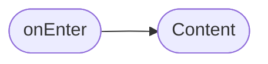
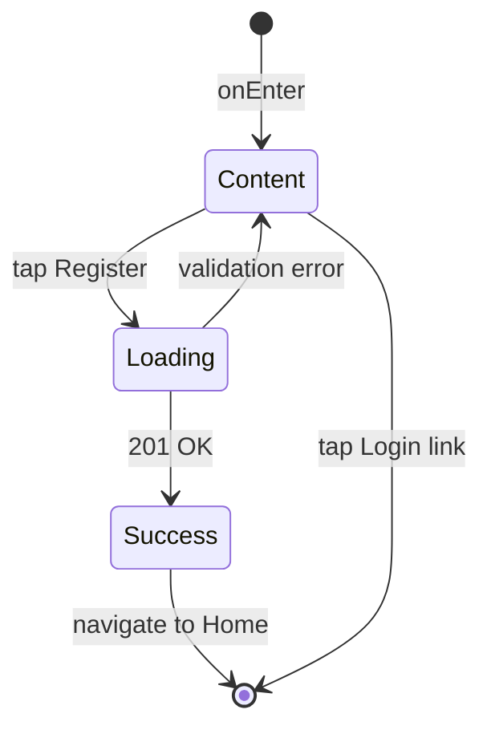

# Экран регистрации

**ID:** SCR-001  
**Тип:** Экран  
**Домен:** 01. Аутентификация  
**Приоритет:** High  
**Статус:** Актуален  
**Функциональные блоки:** FB-AUTH-001, FB-PROFILE-001  
**Зона авторизации:** НЗ  
**Дизайн-макет:**

---

## Содержание

- [История изменений](#история-изменений)
- [Обзор](#обзор)
- [Навигация](#навигация)
- [Входные данные](#входные-данные)
- [Применяемые логики](#применяемые-логики)
- [Инициализация](#инициализация)
- [Используемые запросы](#используемые-запросы)
- [Макет экрана](#макет-экрана)
- [Элементы экрана](#элементы-экрана)
- [Состояния экрана](#состояния-экрана)
- [Действия пользователя](#действия-пользователя)
- [Связанные требования](#связанные-требования)
- [Критерии приёмки](#критерии-приёмки)

---

## История изменений

| Релиз | ТЗ | Описание изменений |
|-------|-----|-------------------|
| 1.0.0 | [ТЗ на регистрацию](../conclusion-overview.md) | Создание спецификации экрана регистрации |

---

## Обзор

Экран регистрации предназначен для создания новых аккаунтов пользователей в приложении "Кулинарная студия". Позволяет новым клиентам ввести свои контактные данные и создать учетную запись для последующего использования сервиса.

### User Story

> Как новый пользователь, я хочу зарегистрироваться в приложении,
> чтобы получить доступ к возможностям бронирования кулинарных классов.

### Бизнес-ценность

- Увеличение числа пользователей платформы
- Возможность персонализации сервиса для каждого клиента
- Сбор контактной информации для маркетинговых коммуникаций

---

## Навигация

### Входящая (откуда открывается)

| Источник | Триггер | Условие | Передаваемые параметры |
|----------|---------|---------|------------------------|
| [Login Screen](login-screen-spec.md) | Тап на ссылку "Регистрация" | Всегда | — |

### Исходящая (куда ведёт)

| Назначение | Триггер | Передаваемые параметры |
|------------|---------|------------------------|
| [Home Screen](home-screen-spec.md) | Успешная регистрация | `{token}`, `{clientInfo}` |

---

## Входные данные

| Название | Тип | Возможные значения | Описание |
|----------|-----|-------------------|----------|
| `{cacheState}` | Кэш | `{empty}`, `{hasData}` | Состояние кэша перед регистрацией |

---

## Применяемые логики

| Логика | Элемент/Триггер | Описание |
|--------|-----------------|----------|
| [Auth Logic](auth-logic-spec.md) | Кнопка "Зарегистрироваться" | Обработка процесса регистрации и получения токена |

---

## Инициализация

### Диаграмма загрузки



### Запросы при открытии

| № | Запрос | Критичный | Зависит от | Условие |
|---|--------|-----------|------------|---------|
| 1 | — | — | — | Всегда |

> Экран не требует загрузки данных при открытии.

---

## Используемые запросы

### /auth/register

**Тип:** REST  
**Метод:** POST  
**Спецификация:** [openapi-spec-final.yaml](../../api/openapi-spec-final.yaml) → `auth.register`

**Триггер:** Тап на кнопку "Зарегистрироваться"

**Параметры:**

| Параметр | Тип | Обязательность | Источник | Описание |
|----------|-----|----------------|----------|----------|
| `firstName` | string | Да | Поле ввода имени | Имя пользователя |
| `email` | string | Да | Поле ввода email | Email пользователя |
| `phone` | string | Да | Поле ввода телефона | Номер телефона пользователя |
| `password` | string | Да | Поле ввода пароля | Пароль пользователя |

**Обработка ответа:**

| Результат | Условие | UI-реакция |
|-----------|---------|------------|
| Загрузка | — | Лоадер на кнопке, блокировка UI |
| Успех (201) | Регистрация успешна | Переход на Home Screen с токеном |
| HTTP 400 | Невалидные данные | Снек с текстом из `message` |
| HTTP 5xx | — | Снек "Произошла ошибка. Попробуйте позже" |
| Сеть | Нет соединения | Снек "Нет соединения. Проверьте подключение" |

---

**Доступные спецификации:**

REST API (`api/`):
- `openapi-spec-final.yaml` — основная схема API

---

## Макет экрана

### Структура

```
┌─────────────────────────────────────┐
│              Регистрация            │  ← Заголовок
├─────────────────────────────────────┤
│                                     │
│           Поля ввода данных         │  ← Scrollable
│             (имя, email,            │
│           телефон, пароль)          │
│                                     │
├─────────────────────────────────────┤
│       [Зарегистрироваться]          │  ← Основная кнопка
├─────────────────────────────────────┤
│      Уже есть аккаунт? [Войти]      │  ← Ссылка
└─────────────────────────────────────┘
```

### Компоненты

| Компонент | Описание | Обязательность |
|-----------|----------|----------------|
| Поле ввода имени | Поле для ввода имени пользователя | Да |
| Поле ввода email | Поле для ввода электронной почты | Да |
| Поле ввода телефона | Поле для ввода номера телефона | Да |
| Поле ввода пароля | Поле для ввода пароля | Да |
| Кнопка регистрации | Кнопка для отправки данных | Да |
| Ссылка на вход | Ссылка для перехода на экран входа | Да |

---

## Элементы экрана

### 1. Блок ввода данных

| Элемент | Описание | Источник данных | Валидация | Действие |
|---------|----------|-----------------|-----------|----------|
| Поле "Имя*" | Имя пользователя | Ввод пользователя | Только буквы, 2-25 символов. Ошибка: "Имя имеет неверный формат" | — |
| Поле "Email*" | Электронная почта | Ввод пользователя | Корректный email. Ошибка: "Email имеет неверный формат" | — |
| Поле "Телефон*" | Номер телефона | Ввод пользователя | Формат +7XXXXXXXXX. Ошибка: "Телефон имеет неверный формат" | — |
| Поле "Пароль*" | Пароль пользователя | Ввод пользователя | Минимум 8 символов. Ошибка: "Пароль слишком короткий" | — |
| Кнопка "Зарегистрироваться" | Основная кнопка | — | — | Валидация → [/auth/register](#authregister) |
| Ссылка "Войти" | Ссылка на экран входа | — | — | — |

**Момент валидации:** При тапе на кнопку "Зарегистрироваться"

**Логика:**
- Кнопка "Зарегистрироваться": При тапе → валидация всех полей → при успехе отправить запрос [/auth/register](#authregister)

**Условия доступности:**
- Кнопка "Зарегистрироваться" активна, если: все обязательные поля заполнены И валидация пройдена

---

## Состояния экрана

### Таблица состояний

| Состояние | Условие | Отображение |
|-----------|---------|-------------|
| Content | Всегда | Стандартный контент с полями ввода |
| Loading | При отправке запроса | Лоадер на кнопке, блокировка UI |
| Error | Ошибка валидации | Сообщения об ошибках под полями ввода |

### Диаграмма переходов



---

## Действия пользователя

| Действие | Элемент | Триггер | Результат |
|----------|---------|---------|-----------|
| Ввод имени | Поле "Имя" | Input | Сохранение значения |
| Ввод email | Поле "Email" | Input | Сохранение значения |
| Ввод телефона | Поле "Телефон" | Input | Сохранение значения |
| Ввод пароля | Поле "Пароль" | Input | Сохранение значения |
| Регистрация | Кнопка "Зарегистрироваться" | Tap | Валидация и отправка запроса |
| Переход ко входу | Ссылка "Войти" | Tap | Переход на [Login Screen](login-screen-spec.md) |

---

## Связанные требования

### Функциональные (REQ-FUNC-*)

| ID | Название | Приоритет |
|----|----------|-----------|
| REQ-FUNC-001 | Регистрация нового пользователя | High |
| REQ-FUNC-002 | Валидация данных при регистрации | Medium |

### Интеграции (REQ-INT-*)

| ID | Название | Приоритет |
|----|----------|-----------|
| REQ-INT-001 | Интеграция с /auth/register | High |

### UI (REQ-UI-*)

| ID | Название | Приоритет |
|----|----------|-----------|
| REQ-UI-001 | Адаптивный дизайн формы регистрации | Medium |
| REQ-UI-002 | Валидация полей в реальном времени | Low |

### Данные (REQ-DATA-*)

| ID | Название | Приоритет |
|----|----------|-----------|
| REQ-DATA-001 | Хранение временных данных формы | Low |

---

## Критерии приёмки

### Позитивные сценарии

| ID | Критерий | Приоритет |
|----|----------|-----------|
| AC-001 | **Дано** пользователь на экране регистрации, **Когда** вводит корректные данные и нажимает "Зарегистрироваться", **Тогда** происходит успешная регистрация и переход на главный экран | P0 |
| AC-002 | **Дано** пользователь заполнил часть полей, **Когда** нажимает на ссылку "Войти", **Тогда** переходит на экран входа | P0 |

### Негативные сценарии

| ID | Критерий | Приоритет |
|----|----------|-----------|
| AC-N01 | **Дано** ошибка сети, **Когда** отправка формы регистрации, **Тогда** отображается сообщение об ошибке | P0 |
| AC-N02 | **Дано** невалидные данные, **Когда** отправка формы, **Тогда** отображаются ошибки валидации | P1 |

### Граничные условия (Edge Cases)

| ID | Критерий | Приоритет |
|----|----------|-----------|
| AC-E01 | **Дано** текст в полях > лимита символов, **Когда** ввод, **Тогда** ограничение ввода | P1 |
| AC-E02 | **Дано** потеря сети во время запроса, **Когда** восстановление, **Тогда** возможность повторной попытки | P2 |