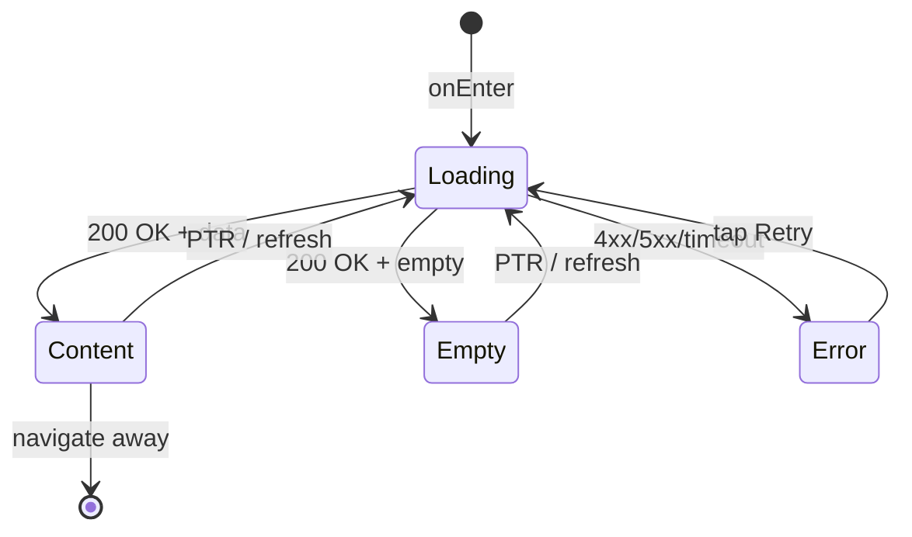

# Экран расписания (Schedule)

**ID:** SCR-004  
**Тип:** Экран  
**Домен:** 03. Расписание  
**Приоритет:** High  
**Статус:** Актуален  
**Функциональные блоки:** FB-CLASSES-001, FB-CHEFS-001  
**Зона авторизации:** АЗ  
**Дизайн-макет:**

---

## Содержание

- [История изменений](#история-изменений)
- [Обзор](#обзор)
- [Навигация](#навигация)
- [Входные данные](#входные-данные)
- [Применяемые логики](#применяемые-логики)
- [Инициализация](#инициализация)
- [Используемые запросы](#используемые-запросы)
- [Макет экрана](#макет-экрана)
- [Элементы экрана](#элементы-экрана)
- [Состояния экрана](#состояния-экрана)
- [Действия пользователя](#действия-пользователя)
- [Связанные требования](#связанные-требования)
- [Критерии приёмки](#критерии-приёмки)

---

## История изменений

| Релиз | ТЗ | Описание изменений |
|-------|-----|-------------------|
| 1.0.0 | [ТЗ на экран расписания](../conclusion-overview.md) | Создание спецификации экрана расписания |

---

## Обзор

Экран расписания отображает доступные кулинарные классы на 7 дней, позволяя пользователю просматривать расписание, применять фильтры и записываться на интересующие классы.

### User Story

> Как пользователь, я хочу видеть расписание кулинарных классов,
> чтобы выбрать и записаться на интересующий меня класс.

### Бизнес-ценность

- Упрощение процесса записи на классы
- Повышение вовлеченности пользователей
- Улучшение планирования посещений классов

---

## Навигация

### Входящая (откуда открывается)

| Источник | Триггер | Условие | Передаваемые параметры |
|----------|---------|---------|------------------------|
| [Bottom Navigation](#) | Тап на иконку "Расписание" | Всегда | — |
| [Home Screen](home-screen-spec.md) | Тап на кнопку "Посмотреть все классы" | Всегда | — |
| Deep link | `app://schedule` | Всегда | — |

### Исходящая (куда ведёт)

| Назначение | Триггер | Передаваемые параметры |
|------------|---------|------------------------|
| [Class Detail Screen](class-detail-screen-spec.md) | Тап на класс | `{classId}` |
| [Booking Screen](booking-screen-spec.md) | Тап на "Забронировать" в деталях | `{classId}` |

---

## Входные данные

| Название | Тип | Возможные значения | Описание |
|----------|-----|-------------------|----------|
| `{filters}` | Состояние | `{activeFilters}` | Активные фильтры для отображения классов |
| `{dateRange}` | Состояние | `{startDate, endDate}` | Диапазон дат для отображения расписания |

---

## Применяемые логики

| Логика | Элемент/Триггер | Описание |
|--------|-----------------|----------|
| [Class Logic](#) | Загрузка и фильтрация классов | Получение списка классов и применение фильтров |
| [Filter Logic](#) | Применение фильтров | Обработка и применение фильтров к списку классов |

---

## Инициализация

### Диаграмма загрузки

```mermaid
flowchart LR
    Start([onEnter]) --> P1[/classes]
    Start --> P2[/chefs]
    
    P1 --> Ready([Content])
    P2 --> Ready
```

### Запросы при открытии

| № | Запрос | Критичный | Зависит от | Условие |
|---|--------|-----------|------------|---------|
| 1 | [/classes](#classes) | Да | — | Всегда |
| 2 | [/chefs](#chefs) | Нет | — | Всегда |

> Полное описание запросов см. в секции [Используемые запросы](#используемые-запросы).

---

## Используемые запросы

### /classes

**Тип:** REST  
**Метод:** GET  
**Спецификация:** [openapi-spec-final.yaml](../../api/openapi-spec-final.yaml) → `classes.get`

**Триггер:** Инициализация и обновление

**Headers:**

| Поле | Описание |
|------|----------|
| `authorization` | Bearer токен пользователя (необязательно) |

**Параметры:**

| Параметр | Тип | Обязательность | Источник | Описание |
|----------|-----|----------------|----------|----------|
| `date_from` | string | Нет | — | Начальная дата фильтрации (по умолчанию - сегодня) |
| `date_to` | string | Нет | — | Конечная дата фильтрации (по умолчанию - 7 дней от сегодня) |
| `chef_id` | string | Нет | Фильтр | Фильтр по ID шефа |
| `class_type` | string | Нет | Фильтр | Фильтр по типу класса |

**Обработка ответа:**

| Результат | Условие | UI-реакция |
|-----------|---------|------------|
| Загрузка | — | Скелетон / Шиммер блока |
| Успех (200) | `data` не пуст | Отобразить список/сетку классов |
| Успех (200) | `data` пуст | Empty state с сообщением "Нет доступных классов" |
| HTTP 4xx | — | Error state с кнопкой "Обновить" |
| HTTP 5xx | — | Error state с кнопкой "Обновить" |
| Сеть | Нет соединения | Error state с кнопкой "Обновить" |

---

### /chefs

**Тип:** REST  
**Метод:** GET  
**Спецификация:** [openapi-spec-final.yaml](../../api/openapi-spec-final.yaml) → `chefs.get`

**Триггер:** Инициализация

**Headers:**

| Поле | Описание |
|------|----------|
| `authorization` | Bearer токен пользователя (необязательно) |

**Параметры:**

| Параметр | Тип | Обязательность | Источник | Описание |
|----------|-----|----------------|----------|----------|

**Обработка ответа:**

| Результат | Условие | UI-реакция |
|-----------|---------|------------|
| Загрузка | — | — (фоновая загрузка) |
| Успех (200) | — | Подготовить данные для фильтра по шефам |
| HTTP 4xx | — | — (данные не обязательны) |
| HTTP 5xx | — | — (данные не обязательны) |
| Сеть | Нет соединения | — (данные не обязательны) |

---

**Доступные спецификации:**

REST API (`api/`):
- `openapi-spec-final.yaml` — основная схема API

---

## Макет экрана

### Структура

```
┌─────────────────────────────────────┐
│ [←] Расписание            [Фильтр] │  ← Header
├─────────────────────────────────────┤
│                                     │
│           Панель фильтров           │  ← Scrollable
│                                     │
├─────────────────────────────────────┤
│                                     │
│          Календарь (7 дней)         │  ← Scrollable
│                                     │
├─────────────────────────────────────┤
│                                     │
│         Список/сетка классов        │  ← Scrollable
│                                     │
└─────────────────────────────────────┘
```

### Компоненты

| Компонент | Описание | Обязательность |
|-----------|----------|----------------|
| Панель фильтров | Фильтры по типу класса, шефу, цене | Да |
| Календарь | Отображение 7 дней | Да |
| Список/сетка классов | Отображение классов по дням | Да |
| Индикаторы доступных мест | Отображение количества мест | Да |

---

## Элементы экрана

### 1. Панель фильтров

| Элемент | Описание | Источник данных | Валидация | Действие |
|---------|----------|-----------------|-----------|----------|
| Фильтр по типу класса | Выпадающий список/табы | `/chefs`, `/classes` | — | Применить фильтр |
| Фильтр по шефу | Выпадающий список | `/chefs` | — | Применить фильтр |
| Фильтр по цене | Слайдер/диапазон | `/classes` | — | Применить фильтр |
| Кнопка "Сбросить" | Сброс всех фильтров | — | — | Сбросить фильтры |

**Логика:**
- Фильтры: При изменении фильтров → обновление списка классов с новыми параметрами

### 2. Календарь

| Элемент | Описание | Источник данных | Валидация | Действие |
|---------|----------|-----------------|-----------|----------|
| Дни недели | Отображение 7 дней | — | — | Выбор диапазона дат |
| Выбранный день | Индикатор выбранного дня | — | — | — |

**Логика:**
- Календарь: При выборе дня → фильтрация классов по выбранной дате

### 3. Список/сетка классов

| Элемент | Описание | Источник данных | Валидация | Действие |
|---------|----------|-----------------|-----------|----------|
| Карточка класса | Информация о классе | `/classes` | — | Тап → [Class Detail](class-detail-screen-spec.md) |
| Кнопка "Забронировать" | Кнопка для бронирования | `/classes` | — | Тап → [Class Detail](class-detail-screen-spec.md) |
| Индикатор мест | Количество доступных мест | `/classes` | — | — |

**Логика:**
- Карточка класса: [Class Logic](#) — отображение информации о классе и состоянии мест

---

## Состояния экрана

### Таблица состояний

| Состояние | Условие | Отображение |
|-----------|---------|-------------|
| Loading | Ожидание API | Скелетон-шиммер для списка классов |
| Content | API 200 + данные | Стандартный контент с фильтрами и классами |
| Empty | API 200 + нет классов | Empty state с сообщением "Нет доступных классов" |
| Error | API 4xx/5xx | Error state с кнопкой "Обновить" |

### Диаграмма переходов



---

## Действия пользователя

| Действие | Элемент | Триггер | Результат |
|----------|---------|---------|-----------|
| Применение фильтров | Панель фильтров | Изменение значений | Обновление списка классов |
| Выбор даты | Календарь | Tap на дату | Фильтрация по выбранной дате |
| Просмотр класса | Карточка класса | Tap | Переход на [Class Detail](class-detail-screen-spec.md) |
| Бронирование | Кнопка "Забронировать" | Tap | Переход на [Class Detail](class-detail-screen-spec.md) |
| Обновление | Pull to refresh | Pull down | Обновление данных |

---

## Связанные требования

### Функциональные (REQ-FUNC-*)

| ID | Название | Приоритет |
|----|----------|-----------|
| REQ-FUNC-008 | Отображение расписания классов | High |
| REQ-FUNC-009 | Фильтрация классов | Medium |
| REQ-FUNC-010 | Просмотр деталей класса | High |

### Интеграции (REQ-INT-*)

| ID | Название | Приоритет |
|----|----------|-----------|
| REQ-INT-006 | Интеграция с /classes | High |
| REQ-INT-007 | Интеграция с /chefs | Medium |

### UI (REQ-UI-*)

| ID | Название | Приоритет |
|----|----------|-----------|
| REQ-UI-007 | Адаптивный дизайн списка классов | Medium |
| REQ-UI-008 | Интерактивные фильтры | Medium |

### Данные (REQ-DATA-*)

| ID | Название | Приоритет |
|----|----------|-----------|
| REQ-DATA-005 | Кэширование списка классов | Medium |
| REQ-DATA-006 | Сохранение выбранных фильтров | Low |

---

## Критерии приёмки

### Позитивные сценарии

| ID | Критерий | Приоритет |
|----|----------|-----------|
| AC-001 | **Дано** пользователь на экране расписания, **Когда** открывает экран, **Тогда** видит список доступных классов на 7 дней | P0 |
| AC-002 | **Дано** пользователь выбирает фильтры, **Когда** применяет их, **Тогда** список классов обновляется в соответствии с фильтрами | P0 |

### Негативные сценарии

| ID | Критерий | Приоритет |
|----|----------|-----------|
| AC-N01 | **Дано** ошибка сети, **Когда** открытие экрана расписания, **Тогда** отображается error state с кнопкой "Обновить" | P0 |
| AC-N02 | **Дано** нет доступных классов, **Когда** открытие экрана, **Тогда** отображается empty state | P1 |

### Граничные условия (Edge Cases)

| ID | Критерий | Приоритет |
|----|----------|-----------|
| AC-E01 | **Дано** много фильтров, **Когда** выбор, **Тогда** отображение адаптивного интерфейса | P1 |
| AC-E02 | **Дано** потеря сети во время работы, **Когда** восстановление, **Тогда** автоматическое обновление данных | P2 |