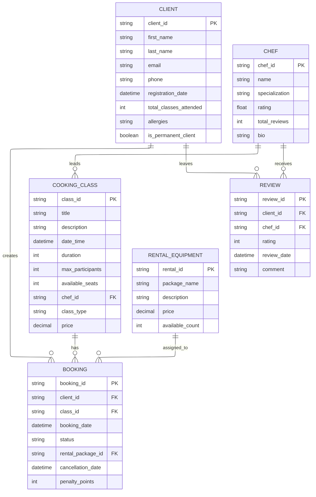

# Финальная ER-модель в нотации Mermaid

## Основная диаграмма

## Описание изменений

### 1. Удаление связи между REVIEW и COOKING_CLASS
- **Проблема:** Ранее была добавлена связь REVIEW с COOKING_CLASS, что не соответствует брифу
- **Исправление:** Удалена связь REVIEW --|| COOKING_CLASS, так как по брифу оценки предназначены только шефам, а не классам

### 2. Упрощение сущности REVIEW
- **Проблема:** Ранее в REVIEW был атрибут class_id, что подразумевало оценку класса
- **Исправление:** Удален атрибут class_id из сущности REVIEW, оставлены только связи с клиентом и шефом

### 3. Добавление комментария к отзыву
- **Изменение:** Добавлен атрибут comment в сущность REVIEW, так как в брифе упоминается возможность оставлять отзывы

## Исправленное описание отношений:

- CLIENT --(создает)--> BOOKING (One-to-Many)
- COOKING_CLASS --(имеет)--> BOOKING (One-to-Many)
- CHEF --(ведет)--> COOKING_CLASS (One-to-Many)
- CLIENT --(оставляет)--> REVIEW (One-to-Many)
- CHEF --(получает)--> REVIEW (One-to-Many)
- RENTAL_EQUIPMENT --(назначается)--> BOOKING (One-to-Many)

## Классификация сущностей по типу доступа:

### Read-only сущности:
- Chef: информация о шефах поступает из существующего бэкенда, клиентское приложение только отображает
- CookingClass: расписание и информация о классах поступают из бэкенда, клиент не может их создавать или редактировать
- RentalEquipment: информация о доступном оборудовании для проката поступает из бэкенда

### Read/Write сущности:
- Client: клиент может регистрироваться, обновлять свой профиль
- Booking: клиент может создавать и отменять бронирования
- Review: клиент может создавать отзывы о шефах (один раз на посещенный класс)

### Write-once сущности:
- Review: после создания отзыв не может быть изменен или удален клиентом

## Соответствие брифу

Эта модель теперь точно соответствует брифу, где указано:
- "после класса клиент мог поставить оценку шефу"
- Оценки предназначены исключительно для шефов, а не для классов
- Цель - "видеть, кто как заходит людям" (о шефах, а не о классах)