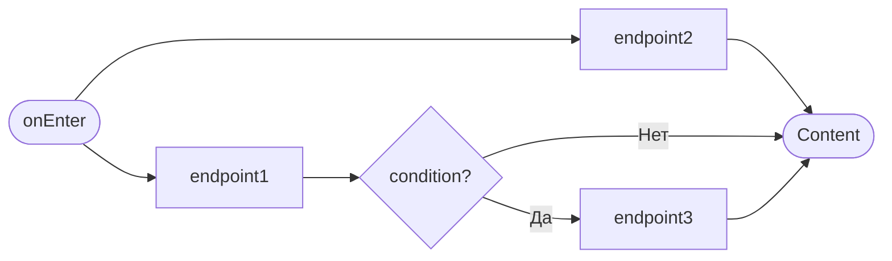
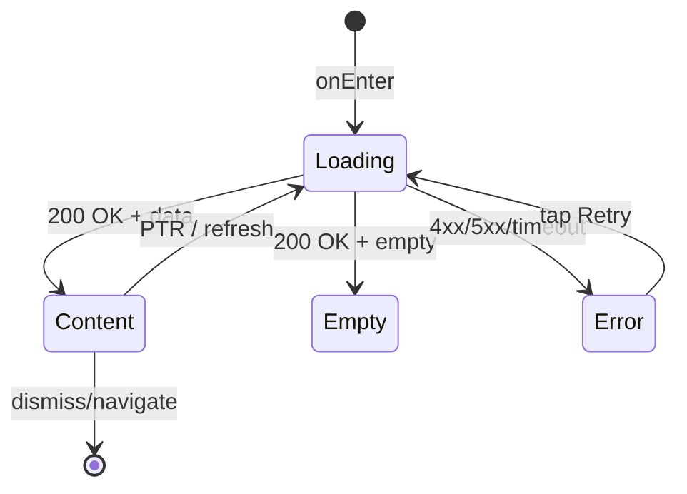

# {Название экрана/шторки}

**ID:** {SCR-XXX | BS-XXX}  
**Тип:** {Экран | Bottom Sheet}  
**Домен:** {NN. Название домена}  
**Приоритет:** {Critical | High | Medium | Low}  
**Статус:** {Черновик | На согласовании | Актуален | Устарел}  
**Функциональные блоки:** {FB-XXX-001, FB-XXX-002, ...}  
**Зона авторизации:** {НЗ | АЗ | НЗ + АЗ}  
**Дизайн-макет:** [{Figma}]({ссылка}) — версия X.X

---

## Содержание

- [История изменений](#история-изменений)
- [Обзор](#обзор)
- [Навигация](#навигация)
- [Входные данные](#входные-данные)
- [Применяемые логики](#применяемые-логики)
- [Свойства Bottom Sheet](#свойства-bottom-sheet)
- [Инициализация](#инициализация)
- [Используемые запросы](#используемые-запросы)
- [Макет экрана](#макет-экрана)
- [Элементы экрана](#элементы-экрана)
- [Состояния экрана](#состояния-экрана)
- [Действия пользователя](#действия-пользователя)
- [Связанные требования](#связанные-требования)
- [Критерии приёмки](#критерии-приёмки)
---

## История изменений

| Релиз | ТЗ | Описание изменений |
|-------|-----|-------------------|
| {x.x.x} | [{Название ТЗ}]({ссылка}) | {Описание} |

---

## Обзор

{Краткое описание экрана/шторки и его назначение в приложении}

### User Story

> Как {роль пользователя}, я хочу {действие},
> чтобы {цель/польза}.

### Бизнес-ценность

- {Ценность 1}
- {Ценность 2}
- {Ценность 3}

---

## Навигация

### Входящая (откуда открывается)

| Источник | Триггер | Условие | Передаваемые параметры |
|----------|---------|---------|------------------------|
| [{SCR-XXX Название}]({путь.md}) | Тап на элемент | {Условие или "Всегда"} | `{param1}`, `{param2}` |
| [{BS-XXX Название}]({путь.md}) | Тап на элемент | {Условие} | `{param}` |
| Deep link | `/{path}/{param}` | Всегда | `{param}` |
| Push-уведомление | Тап на уведомление | `type = {value}` | `{payload}` |

### Исходящая (куда ведёт)

| Назначение | Триггер | Передаваемые параметры |
|------------|---------|------------------------|
| [{SCR-XXX Название}]({путь.md}) | {Действие} | `{param}` |
| [{BS-XXX Название}]({путь.md}) | {Действие} | `{param}` |

---

## Входные данные

| Название | Тип | Возможные значения | Описание |
|----------|-----|-------------------|----------|
| `{inputName}` | {Состояние / Кэш / Remote Config} | `{value1}`, `{value2}` | {Описание} |

---

## Применяемые логики

> *Секция опциональна. Указывать, если на экране используется переиспользуемая бизнес-логика из раздела [09_Логики](09_Логики/_INDEX.md).*

| Логика | Элемент/Триггер | Описание |
|--------|-----------------|----------|
| [LOGIC-XXX {Название}](../09_Логики/LOGIC-XXX_{Название}.md) | {Кнопка / Элемент} | {Краткое описание логики} |

---

## Свойства Bottom Sheet

> *Секция только для типа "Bottom Sheet"*

| Свойство | Значение |
|----------|----------|
| Высота | {Динамическая / Фиксированная / Fullscreen} |
| Закрытие свайпом | {Да / Нет} |
| Закрытие по тапу вне области | {Да / Нет} |
| Затемнение фона | {Да / Нет} |
| Кнопка закрытия | {Да (позиция) / Нет} |

---

## Инициализация

> **Примечание:** Если при открытии экрана не отправляются запросы (данные берутся из кэша), укажите это в таблице запросов и опишите источники данных во [Входных данных](#входные-данные).

### Диаграмма загрузки



### Запросы при открытии

| № | Запрос | Критичный | Зависит от | Условие |
|---|--------|-----------|------------|---------|
| 1 | [{endpoint1}](#endpoint1) | Да | — | Всегда |
| 2 | [{queryName}](#queryname) | Да | — | `{inputName} = {value}` |
| 3 | [{endpoint3}](#endpoint3) | Нет | №1 | `{inputName} != null` |

> Полное описание запросов см. в секции [Используемые запросы](#используемые-запросы).

---

## Используемые запросы

> Все API-запросы экрана с полным описанием параметров и обработки ответов.

### {endpoint1}

**Тип:** REST  
**Метод:** {GET/POST/PUT/DELETE}  
**Спецификация:** [rigla_network/rest/domains/{domain}.yaml](../../rigla_network/rest/domains/{domain}.yaml) → `{operationId}`

**Триггер:** Инициализация

**Параметры:**

| Параметр | Тип | Обязательность | Источник | Описание |
|----------|-----|----------------|----------|----------|
| `{param}` | {string/int/bool} | {Да/Нет} | {Источник} | {Описание} |

**Обработка ответа:**

| Результат | Условие | UI-реакция |
|-----------|---------|------------|
| Загрузка | — | Скелетон / Шиммер блока |
| Успех | `data` не пуст | Отобразить данные |
| Успех | `data` пуст | Empty state |
| HTTP 4xx | — | Error state с кнопкой "Обновить" |
| HTTP 5xx | — | Error state с кнопкой "Обновить" |
| Сеть | Нет соединения | Error state с кнопкой "Обновить" |

---

### {queryName}

**Тип:** GraphQL  
**Спецификация:** [rigla_network/gql/schema_rigla.graphql](../../rigla_network/gql/schema_rigla.graphql) → `Query.{queryName}`

**Триггер:** Инициализация

**Переменные:**

| Переменная | Тип | Обязательность | Источник | Описание |
|------------|-----|----------------|----------|----------|
| `${var}` | {String!/Int} | {Да/Нет} | {Источник} | {Описание} |

**Обработка ответа:**

| Результат | Условие | UI-реакция |
|-----------|---------|------------|
| Загрузка | — | Скелетон / Шиммер блока |
| `data` | Не пуст | Отобразить |
| `data` | Пуст | Empty state |
| `errors` | Есть блок | Error state с кнопкой "Обновить" |
| HTTP 4xx/5xx | — | Error state с кнопкой "Обновить" |
| Сеть | Нет соединения | Error state с кнопкой "Обновить" |

---

### {endpoint3}

**Тип:** REST  
**Метод:** {GET/POST/PUT/DELETE}  
**Спецификация:** [rigla_network/rest/domains/{domain}.yaml](../../rigla_network/rest/domains/{domain}.yaml) → `{operationId}`

**Триггер:** Инициализация (после {endpoint1})

**Параметры:**

| Параметр | Тип | Обязательность | Источник | Описание |
|----------|-----|----------------|----------|----------|
| `{param}` | {string/int/bool} | {Да/Нет} | {Источник} | {Описание} |

**Обработка ответа:**

| Результат | Условие | UI-реакция |
|-----------|---------|------------|
| Загрузка | — | Скелетон / Шиммер блока |
| Успех | `data` не пуст | Отобразить блок |
| Успех | `data` пуст | Скрыть блок |
| HTTP 4xx | — | Блок не отображается |
| HTTP 5xx | — | Блок не отображается |
| Сеть | Нет соединения | Блок не отображается |

---

### {actionEndpoint}

**Тип:** REST  
**Метод:** {POST/PUT/DELETE}  
**Спецификация:** [rigla_network/rest/domains/{domain}.yaml](../../rigla_network/rest/domains/{domain}.yaml) → `{operationId}`

**Триггер:** {Тап на кнопку / Ввод текста / и т.д.}

**Параметры:**

| Параметр | Тип | Обязательность | Источник | Описание |
|----------|-----|----------------|----------|----------|
| `{param}` | {string/int/bool} | {Да/Нет} | {Источник} | {Описание} |

**Обработка ответа:**

| Результат | Условие | UI-реакция |
|-----------|---------|------------|
| Загрузка | — | Лоадер на кнопке / Блокировка UI |
| Успех | — | {Описание действия} |
| HTTP 4xx | `message` содержит текст | Снек с текстом из `message` |
| HTTP 5xx | — | Снек "Произошла ошибка. Попробуйте позже" |
| Сеть | Нет соединения | Снек "Нет соединения. Проверьте подключение" |

---

**Доступные спецификации:**

REST API (`rigla_network/rest/domains/`):
- `authentication.yaml` — авторизация, токены
- `cart_mine.yaml`, `cart_guest.yaml` — корзина
- `checkout.yaml` — оформление заказа
- `customer_profile.yaml` — профиль пользователя
- `orders.yaml` — заказы
- `reviews.yaml` — отзывы
- `wishlist.yaml` — избранное
- `mindbox_loyalty.yaml` — программа лояльности

GraphQL (`rigla_network/gql/`):
- `schema_rigla.graphql` — основная схема

---

## Макет экрана

### Структура

```
┌─────────────────────────────────────┐
│ [←] Заголовок              [Action] │  ← Header
├─────────────────────────────────────┤
│                                     │
│           Content Area              │  ← Scrollable
│                                     │
├─────────────────────────────────────┤
│         [Primary Button]            │  ← Fixed Bottom (опционально)
└─────────────────────────────────────┘
```

### Компоненты

| Компонент | Описание | Обязательность |
|-----------|----------|----------------|
| {Название} | {Описание} | {Да / Опционально} |

---

## Элементы экрана

> **Примечания:**
> - **Колонка "Валидация":** Для полей ввода указать правило и текст ошибки. Для остальных элементов — "—".
> - **Логика:** Описывается после таблицы каждого блока в виде текстового блока "**Логика:**". Если элемент использует переиспользуемую логику из раздела [09_Логики](09_Логики/_INDEX.md), укажите ссылку на неё.
> - **Условия доступности:** Для кнопок и интерактивных элементов указать условия активности/видимости после таблицы.

### 1. {Название секции/блока}

| Элемент | Описание | Источник данных | Валидация | Действие |
|---------|----------|-----------------|-----------|----------|
| {Элемент} | {Описание} | `{параметр}` из {запрос} | — | Открыть [{Название}]({путь.md}) |
| {Элемент без логики} | {Описание} | `{параметр}` | — | — |

**Логика:**
- {Элемент}: [LOGIC-XXX](../09_Логики/LOGIC-XXX_{Название}.md) — {краткое описание логики}

### 2. {Название секции с полями ввода}

| Элемент | Описание | Источник данных | Валидация | Действие |
|---------|----------|-----------------|-----------|----------|
| Поле "Имя*" | Имя получателя | `firstname` из кэша | Кириллица, 2-25 символов. Ошибка: "Имя имеет неверный формат" | — |
| Поле "Телефон*" | Номер телефона | `telephone` из кэша | `^9\d{9}$`. Ошибка: "Телефон имеет неверный формат" | — |
| Поле "Email*" | Электронная почта | `email` из кэша | Корректный email. Ошибка: "Email имеет неверный формат" | — |
| Кнопка "Отправить" | Primary button | — | — | Валидация → [{actionEndpoint}](#actionendpoint) |

**Момент валидации:** {При потере фокуса / При отправке формы}

**Логика:**
- Кнопка "Отправить": При тапе → валидация всех полей → при успехе отправить запрос [{actionEndpoint}](#actionendpoint)

**Условия доступности:**
- Кнопка "Отправить" активна, если: все обязательные поля заполнены И валидация пройдена
- Таб "{Название}" скрыт, если: `{condition} = {value}`

---

## Состояния экрана

### Таблица состояний

| Состояние | Условие | Отображение |
|-----------|---------|-------------|
| Loading | Ожидание API | Скелетон-шиммер |
| Content | API 200 + data | Стандартный контент |
| Empty | API 200 + empty | Заглушка "{текст}" |
| Error | API 4xx/5xx | Error state с кнопкой "Обновить" |

### Диаграмма переходов



---

## Действия пользователя

| Действие | Элемент | Триггер | Результат |
|----------|---------|---------|-----------|
| {Действие} | {Элемент} | {Tap/Swipe/Pull} | Переход на [{Название}]({путь.md}) |

---

## Связанные требования

### Функциональные (REQ-FUNC-*)

| ID | Название | Приоритет |
|----|----------|-----------|
| REQ-FUNC-XXX | {Название} | {Priority} |

### Интеграции (REQ-INT-*)

| ID | Название | Приоритет |
|----|----------|-----------|
| REQ-INT-XXX | {Название} | {Priority} |

### UI (REQ-UI-*)

| ID | Название | Приоритет |
|----|----------|-----------|
| REQ-UI-XXX | {Название} | {Priority} |

### Данные (REQ-DATA-*)

| ID | Название | Приоритет |
|----|----------|-----------|
| REQ-DATA-XXX | {Название} | {Priority} |

---

## Критерии приёмки

### Позитивные сценарии

| ID | Критерий | Приоритет |
|----|----------|-----------|
| AC-001 | **Дано** {контекст}, **Когда** {действие}, **Тогда** {результат} | P0 |
| AC-002 | **Дано** {контекст}, **Когда** {действие}, **Тогда** {результат} | P0 |

### Негативные сценарии

| ID | Критерий | Приоритет |
|----|----------|-----------|
| AC-N01 | **Дано** ошибка сети, **Когда** открытие экрана, **Тогда** отображается error state | P0 |
| AC-N02 | **Дано** невалидный ввод, **Когда** отправка формы, **Тогда** отображается ошибка валидации | P1 |

### Граничные условия (Edge Cases)

| ID | Критерий | Приоритет |
|----|----------|-----------|
| AC-E01 | **Дано** текст > лимита символов, **Когда** ввод, **Тогда** обрезка до лимита | P1 |
| AC-E02 | **Дано** потеря сети во время запроса, **Когда** восстановление, **Тогда** возможность retry | P2 |

---
